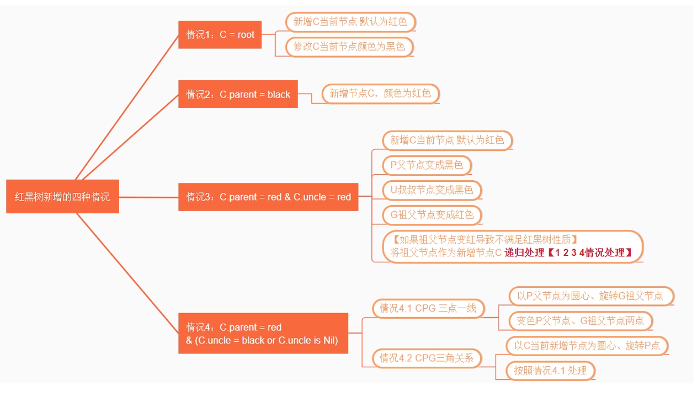

# 概述

1. 数据结构三个方面: 逻辑结构, 存储结构, 数据运算:

- 集合, 线性结构, 树形结构, 网状结构
- 顺序存储结构, 链式存储结构


# 数组

### 1. 无序数组

```java
public class Array {
    private String[] strArray;
    private int length = 0;

    public Array(int max) {
        strArray = new String[max];
    }
    
    public int contains(String target){
        int index = -1;
        for(int i=0;i<length;i++){
            if(strArray[i].equals(target)){
                index = i;
                break;
            }
        }
        return index;
    }
    
    public void insert(String elem){
        strArray[length] = elem;
        length++;
    }
    
    public boolean delete(String target){
        int index = -1;
        if((index = contains(target)) != -1){
            for(int i=index;i<length-1;i++){
                strArray[i] = strArray[i+1];
            }
            length--;
            return true;
        }else {
            return false;
        }
    }
    
    public void display(){
        for(int i=0;i<length;i++){
            System.out.println(strArray[i] + "\t");
        }
    }
}
```

- 优点: 插入快, 知下标可快速存取
- 缺点: 查找慢, 删除慢, 大小固定


### 2.有序数组

数组已经排好序, 适用 查找频繁,而插入删除较少的

```java
public class OrderArray {
    private int[] intArray;
    private int length = 0;

    public OrderArray(int max) {
        intArray = new int[max];
    }

    public OrderArray(int[] intArray) {
        this.intArray = intArray;
        this.length = intArray.length;
    }
    //查找----------------------------
    public int find(int target) {
        int lowerBound = 0;
        int upperBound = length - 1;
        int curIn;

        if (upperBound < 0) {
            return -1;
        }

        while (true) {
            curIn = (lowerBound + upperBound) / 2;
            if (target == intArray[curIn]) {
                return curIn;
            } else if (curIn == lowerBound) {
                if (target != intArray[upperBound]) {
                    return -1;
                }
            } else {
                if (intArray[curIn] < target) {
                    lowerBound = curIn;
                } else {
                    upperBound = curIn;
                }
            }
        }
    }
    //插入--------------------------------
    public void insert(int elem) {
        int location = 0;
        for (; location < length; location++) {
            if (intArray[location] > elem) break;
        }
        for (int i = length; i > location; i--) {
            intArray[i] = intArray[i - 1];
        }
        intArray[location] = elem;
        length++;
    }
    //删除------------------------------------
    public boolean delete(int target) {
        int index = -1;
        if ((index = find(target)) != -1) {
            for (int i = index; i < length - 1; i++) {
                intArray[i] = intArray[i + 1];
            }
            length--;
            return true;
        } else {
            return false;
        }
    }
    //输出--------------------------------------
    public void display() {
        for (int i = 0; i < length; i++) {
            System.out.print(intArray[i] + "\t");
        }
        System.out.println();
    }
}
```

- 可以使用二分查找
- 优点: 查找效率高
- 缺点: 删除和插入慢, 大小固定


# 栈

- 先入后出, 受限数列

### 1. 实现

```java
public class Stack {
    private int size;
    private int top;
    private int[] stackArray;
    //初始化
    public Stack(int size) {
        stackArray = new int[size];
        top = -1;
        this.size = size;
    }
    //入栈------------------
    public void push(int elem) {
        stackArray[++top] = elem;
    }
    //出栈---------------
    public int pop() {
        return stackArray[top--];
    }
    //查看栈顶元素-------------------
    public int peek() {
        return stackArray[top];
    }
    //判空---------------------------
    public boolean isEmpty() {
        return (top == -1);
    }
    //判满-------------------------
    public boolean isFull() {
        return (top == size - 1);
    }
}
```

### 2. 应用实例

- 分配符匹配


# 队列

- 先进先出 FIFO

### 1. 循环队列实现

```java
public class Queue {

    private int[] queArray;
    private int maxSize;
    public int front; //存储队头元素的下标
    public int rear; //存储队尾元素的下标
    private int length; //队列长度

    //构造方法，初始化队列
    public Queue(int maxSize) {
        this.maxSize = maxSize;
        queArray = new int[maxSize];
        front = 0;
        rear = -1;
        length = 0;
    }

    //插入
    public void insert(int elem) throws Exception {
        if (isFull()) {
            throw new Exception("队列已满，不能进行插入操作！");
        }
        //如果队尾指针已到达数组的末端，插入到数组的第一个位置
        if (rear == maxSize - 1) {
            rear = -1;
        }
        queArray[++rear] = elem;
        length++;
    }

    //移除
    public int remove() throws Exception {
        if (isEmpty()) {
            throw new Exception("队列为空，不能进行移除操作！");
        }
        int elem = queArray[front++];
        //如果队头指针已到达数组末端，则移到数组第一个位置
        if (front == maxSize) {
            front = 0;
        }
        length--;
        return elem;
    }

    //查看队头元素
    public int peek() throws Exception {
        if (isEmpty()) {
            throw new Exception("队列内没有元素！");
        }
        return queArray[front];
    }

    //获取队列长度
    public int size() {
        return length;
    }

    //判空
    public boolean isEmpty() {
        return (length == 0);
    }

    //判满
    public boolean isFull() {
        return (length == maxSize);
    }
}
```

- 双端队列是队列和栈的综合体, 可以两边操作或限制操作

### 2. 优先级队列

- 有队头和队尾, 也是从头移除,
- 插入时按关键字顺序插入
- 数据项少或者不关心速度时: 可以使用数组实现; 反之用堆实现

以下使用数组实现:

```java
public class PriorityQueue {

    private int[] queArray;
    private int maxSize;
    private int length; //队列长度
    private int referencePoint; //基准点

    //构造方法，初始化队列
    public PriorityQueue(int maxSize, int referencePoint) {
        this.maxSize = maxSize;
        this.referencePoint = referencePoint;
        queArray = new int[maxSize];
        length = 0;
    }

    //插入
    public void insert(int elem) throws Exception {
        if (isFull()) {
            throw new Exception("队列已满，不能进行插入操作！");
        }

        //如果队列为空，插入到数组的第一个位置
        if (length == 0) {
            queArray[length++] = elem;
        } else {
            int i;
            for (i = length; i > 0; i--) {

                int dis = Math.abs(elem - referencePoint); //待插入元素的距离
                int curDis = Math.abs(queArray[i - 1] - referencePoint); //当前元素的距离

                //将比插入元素优先级高的元素后移一位
                if (dis >= curDis) {
                    queArray[i] = queArray[i - 1];
                } else {
                    break;
                }
            }
            queArray[i] = elem;
            length++;
        }
    }

    //移除
    public int remove() throws Exception {
        if (isEmpty()) {
            throw new Exception("队列为空，不能进行移除操作！");
        }
        int elem = queArray[--length];
        return elem;
    }

    //查看队头元素
    public int peek() throws Exception {
        if (isEmpty()) {
            throw new Exception("队列内没有元素！");
        }
        return queArray[length - 1];
    }

    //返回队列长度
    public int size() {
        return length;
    }

    //判空
    public boolean isEmpty() {
        return (length == 0);
    }

    //判满
    public boolean isFull() {
        return (length == maxSize);
    }

}
```


# 链表

- 插入删除快, 查找慢

### 1. 单链表

```java
//链结点的封装类
public class Link {

    public int age;
    public String name;
    public Link next; //指向该链结点的下一个链结点

    //构造方法
    public Link(int age, String name) {
        this.age = age;
        this.name = name;
    }

    //打印该链结点的信息
    public void displayLink() {
        System.out.println("name:" + name + ",age:" + age);
    }
}

//链表的封装类
public class LinkList {

    private Link first; //指向链表中的第一个链结点

    public LinkList() {
        first = null;
    }

    //插入到链表的前端
    public void insertFirst(Link link) {
        link.next = first;
        first = link;
    }

    //删除第一个链结点，返回删除的链结点引用
    public Link deleteFirst() throws Exception {
        if (isEmpty()) {
            throw new Exception("链表为空！不能进行删除操作");
        }
        Link temp = first;
        first = first.next;
        return temp;
    }

    //打印出所有的链表元素
    public void displayList() {
        Link cur = first;
        while (cur != null) { //循环打印每个链结点
            cur.displayLink();
            cur = cur.next;
        }
    }

    //删除属性为指定值的链结点
    public Link delete(int key) {
        Link link = null;
        Link cur = first;
        Link next = first.next;
        Link previous = null;
        while (cur != null) {
            if (cur.age == key) { //找到了要删除的链结点
                link = cur;
                //如果当前链结点的前驱为null，证明当其为链表的第一个链结点
                //删除该链结点后需要对first属性重新赋值
                if (previous == null) {
                    this.first = next;
                } else {
                    //删除操作，即将前驱的next指针指向当前链结点的next
                    //链表中将去当前链结点这一环
                    previous.next = next;
                }
                break;
            } else if (cur.next == null) {
                //当前链结点不是目标且下一个链结点为null，证明没有要删除的链结点
                break;
            }

            //当前链结点不是要删除的目标，则向后继续寻找
            next = next.next;
            cur = cur.next;
            previous = cur;
        }

        return link;
    }

    //查找属性为指定值的链结点
    public Link find(int key) {
        Link link = null;
        Link cur = first;
        Link next = null;
        Link previous = null;
        while (cur != null) {
            if (cur.age == key) {
                link = cur;
                break;
            } else if (cur.next == null) {
                //当前链结点不是要找的目标且下一个链结点为null，则证明没有找到目标
                break;
            }

            //当前链结点不是要找的目标且存在下一个链结点，则向后继续寻找
            next = next.next;
            cur = cur.next;
            previous = cur;
        }

        return link;
    }

    //判空
    public boolean isEmpty() {
        return (first == null);
    }
}
```


### 2. 双端链表

- 双端链表与双向链表完全不同
- 双端: 在单链表基础上, 头结点对最后一个结点也有引用

```java
//链表的封装类
public class DoubleEndList {

    private Link first; //指向链表中的第一个链结点
    private Link last; //指向链表中最后一个链结点

    public DoubleEndList() {
        first = null;
        last = null;
    }

    //插入到链表的前端
    public void insertFirst(Link link) {
        if (isEmpty()) { //如果为空链表，则插入的第一个链结点既是表头也是表尾
            last = link;
        }
        link.next = first;
        first = link;
    }

    //插入到链表的末端
    public void insertLast(Link link) {
        if (isEmpty()) { //如果为空链表，则插入的第一个链结点既是表头也是表尾
            first = link;
        } else {
            last.next = link;
        }
        last = link;
    }

    //删除第一个链结点，返回删除的链结点引用
    public Link deleteFirst() throws Exception {
        if (isEmpty()) {
            throw new Exception("链表为空！不能进行删除操作");
        }
        Link temp = first;
        if (first.next == null) {
            last = null; //如果只有一个链结点，则删除后会影响到last指针
        }
        first = first.next;
        return temp;
    }

    //打印出所有的链表元素
    public void displayList() {
        Link cur = first;
        while (cur != null) { //循环打印每个链结点
            cur.displayLink();
            cur = cur.next;
        }
    }

    //判空
    public boolean isEmpty() {
        return (first == null);
    }
}
```


### 3. 有序链表

- 数据有序, 通常用来删除最大最小值
- 有序链表优于有序数组在于插入快, 链表可灵活扩展

```java
//有序链表的封装类
public class SortedList {

    private Link first; //指向链表中的第一个链结点

    public SortedList() {
        first = null;
    }

    //插入
    public void insert(Link link) {
        Link previous = null;
        Link cur = first;
        while (cur != null && link.age > cur.age) { //链表由大到小排列
            previous = cur;
            cur = cur.next;
        }

        if (previous == null) { //如果previous为null，则证明当前链结点为表头
            this.first = link;
        } else {
            previous.next = link;
        }

        link.next = cur;

    }

    //删除第一个链结点，返回删除的链结点引用
    public Link deleteFirst() throws Exception {
        if (isEmpty()) {
            throw new Exception("链表为空！不能进行删除操作");
        }
        Link temp = first;
        first = first.next;
        return temp;
    }

    //打印出所有的链表元素
    public void displayList() {
        Link cur = first;
        while (cur != null) { //循环打印每个链结点
            cur.displayLink();
            cur = cur.next;
        }
    }

    //判空
    public boolean isEmpty() {
        return (first == null);
    }
}
```


### 4. 双向链表

- 结点有后结点引用和前结点引用

```java
package DoublelyLinkList;

//链结点的封装类
class Link {

    public int age;
    public String name;
    public Link next; //指向下一个链结点
    public Link previous; //指向前一个链结点

    //构造方法
    public Link(int age, String name) {
        this.age = age;
        this.name = name;
    }

    //打印该链结点的信息
    public void displayLink() {
        System.out.println("name:" + name + ",age:" + age);
    }
}

//双向链表的封装类
public class DoublelyLinkList {

    private Link first; //指向链表中的第一个链结点
    private Link last; //指向链表中的最后一个链结点

    public DoublelyLinkList() {
        first = null;
        last = null;
    }

    //插入到链表的前端
    public void insertFirst(Link link) {
        if (isEmpty()) { //如果为空链表，则插入的第一个链结点既是表头也是表尾
            last = link;
        } else { //如果不是空链表，则将链表的first指针指向该链结点
            first.previous = link;
        }
        link.next = first;
        first = link;
    }

    //插入到链表的末端
    public void insertLast(Link link) {
        if (isEmpty()) { //如果为空链表，则插入的第一个链结点既是表头也是表尾
            first = link;
        } else {
            last.next = link;
            link.previous = last;
        }
        last = link;
    }

    //删除第一个链结点，返回删除的链结点引用
    public Link deleteFirst() throws Exception {
        if (isEmpty()) {
            throw new Exception("链表为空！不能进行删除操作");
        }
        Link temp = first;
        if (first.next == null) {
            last = null; //如果只有一个链结点，则删除后会影响到last指针
        } else { //如果至少有两个链结点，则将第二个链结点的previous设为null
            first.next.previous = null;
        }
        first = first.next;
        return temp;
    }

    //删除最后一个链结点，返回删除的链结点引用
    public Link deleteLast() throws Exception {
        if (isEmpty()) {
            throw new Exception("链表为空！不能进行删除操作");
        }
        Link temp = last;
        if (last.previous == null) {
            first = null; //如果只有一个链结点，则删除后会影响到first指针
        } else { //如果至少有两个链结点，则将倒数第二个链结点的next设为null
            last.previous.next = null;
        }
        last = last.previous;
        return temp;
    }

    //查找属性为指定值的链结点
    public Link find(int key) {
        Link cur = first;
        while (cur != null && cur.age != key) {
            if (cur.next == null) {
                return null; //当前链结点不是要找的目标且已到达表尾
            }
            cur = cur.next;
        }

        return cur;
    }

    //在指定链结点之后插入，操作成功返回true，操作失败返回false
    public boolean insertAfter(Link link) {
        Link target = find(link.age);
        boolean flag = true;
        if (target == null) { //没找到插入的参照链结点
            flag = false;
        } else { //找到了插入的参照链结点
            if (target.next == null) { //参照链结点为表尾
                insertLast(link);
            } else { //该链表至少有两个链结点
                target.next.previous = link;
                link.next = target.next;
                //必须执行完上面两步，才能执行下面这两步
                //上面两步处理了link和它下一个链结点的关系
                //下面两步处理了link和它上一个链结点的关系
                target.next = link;
                link.previous = target;
            }
        }

        return flag;
    }

    //打印出所有的链表元素
    public void displayList() {
        Link cur = first;
        while (cur != null) { //循环打印每个链结点
            cur.displayLink();
            cur = cur.next;
        }
    }

    //判空
    public boolean isEmpty() {
        return (first == null);
    }

}
```


# 二叉树

- 树每个结点最多只有两个子结点

### 1. 二叉搜索树

- 一个结点的左子结点小于这个结点, 右子结点大于或等于这个结点
- 树的不平衡是由于数据插入顺序造成的, 随机插入趋于平衡, 有序则不平衡

#### 1.1 查找

从根结点开始, 小于转左, 大于转右, 到叶子结点也没有则失败

#### 1.2 插入

先查找出要插入的位置, 将父节点的左或者右子结点指向新结点即可

#### 1.3 遍历

- 前序遍历: 先访问结点, 再访问左子树, 右子树
- 中序遍历: 先访问左子树, 然后结点, 右子树
- 后序遍历: 左子树, 右子树, 结点
- 最常用中序遍历, 中序遍历二叉搜索树会是升序访问遍历
- 递归: 遍历左子树, 访问自身结点, 遍历右子树

#### 1.4 查找最值

- 从根开始循环访问左结点, 一直到结束, 得到最小值
- 从根开始循环访问右结点, 一直到结束, 得到最大值

#### 1.5 删除结点

- 删除结点要考虑三种情况: 该结点没有子结点; 有一个子节点; 有两个子结点
- 第一种直接删除, 父结点的引用设置为null
- 第二种删除该结点, 将该结点的子结点上移, 删的是根则子结点成为根
- 第三种删除该结点, 使用该结点的中序后继来替代该结点

### 2. 实例代码

```java
//树节点的封装类
public class Node {
    int age;
    String name;
    Node leftChild;  //左子节点的引用
    Node rightChild; //右子节点的引用

    public Node(int age,String name){
        this.age = age;
        this.name = name;
    }

    //打印该节点的信息
    public void displayNode(){
        System.out.println("name:"+name+",age:"+age);
    }
}
```


```java
import java.util.ArrayList;
import java.util.List;

//二叉搜索树的封装类
public class BinaryTree {
    private Node root;  //根节点
    
    public BinaryTree(){
        root = null;
    }
    
    //按关键字查找节点
    public Node find(int key){
        Node cur = root;  //从根节点开始查找
        
        if(cur == null){  //如果树为空，直接返回null
            return null;
        }
        
        while(cur.age != key){
            if(key < cur.age){ 
                cur = cur.leftChild;  //如果关键字比当前节点小，转向左子节点
            }else{
                cur = cur.leftChild;  //如果关键字比当前节点大，转向右子节点
            }
            
            if(cur == null){  //没有找到结果，搜索结束
                return null;
            }
        }
        return cur;
    }
    
    //插入新节点
    public void insert(Node node){
        if(root == null){
            root = node;  //如果树为空，则新插入的节点为根节点
        }else{
            Node cur = root;  
            
            while(true){  
                if(node.age < cur.age){
                    if(cur.leftChild == null){  //找到了要插入节点的父节点
                        cur.leftChild = node;
                        return;
                    }
                    cur = cur.leftChild;
                }else{
                    if(cur.rightChild == null){  //找到了要插入节点的父节点
                        cur.rightChild = node;
                        return;
                    }
                    cur = cur.rightChild;
                }
            }
        }
    }
    
    //删除指定节点
    public boolean delete(Node node){
        if(root == null){
            return false;  //如果为空树，直接返回false
        }
        
        boolean isLeftChild = true;  //记录目标节点是否为父节点的左子节点
        Node cur= root;  //要删除的节点
        Node parent = null; //要删除节点的父节点
        
        while(cur.age != node.age){  //确定要删除节点和它的父节点
            parent = cur;
            if(node.age < cur.age){  //目标节点小于当前节点，跳转左子节点
                cur = cur.leftChild;
            }else{//目标节点大于当前节点，跳转右子节点
                isLeftChild = false;
                cur = cur.rightChild;
            }
            if(cur == null){
                return false;  //没有找到要删除的节点
            }
        }
    
        if(cur.leftChild == null && cur.rightChild == null){  //目标节点为叶子节点（无子节点）
            if(cur == root){  //要删除的为根节点
                root = null;
            }else if(isLeftChild){ 
                //要删除的不是根节点，则该节点肯定有父节点，该节点删除后，需要将父节点指向它的引用置空
                parent.leftChild = null;
            }else{
                parent.rightChild = null;
            }
        }else if(cur.leftChild == null){  //只有一个右子节点
            if(cur == root){
                root = cur.rightChild;
            }else if(isLeftChild){
                parent.leftChild = cur.rightChild;
            }else{
                parent.rightChild = cur.rightChild;
            }
        }else if(cur.rightChild == null){  //只有一个左子节点
            if(cur == root){
                root = cur.leftChild;
            }else if(isLeftChild){
                parent.leftChild = cur.leftChild;
            }else{
                parent.rightChild = cur.leftChild;
            }
        }else{  //有两个子节点
            //第一步要找到欲删除节点的后继节点
            Node successor = cur.rightChild;  
            Node successorParent = null;
            while(successor.leftChild != null){
                successorParent = successor;
                successor = successor.leftChild;
            }
            //欲删除节点的右子节点就是它的后继，证明该后继无左子节点，则将以后继节点为根的子树上移即可
            if(successorParent == null){  
                if(cur == root){  //要删除的为根节点，则将后继设置为根，且根的左子节点设置为欲删除节点的做左子节点
                    root = successor;
                    root.leftChild = cur.leftChild;
                }else if(isLeftChild){ 
                    parent.leftChild = successor;
                    successor.leftChild = cur.leftChild;
                }else{
                    parent.rightChild = successor;
                    successor.leftChild = cur.leftChild;
                }
            }else{ //欲删除节点的后继不是它的右子节点
                successorParent.leftChild = successor.rightChild;
                successor.rightChild = cur.rightChild;
                if(cur == root){  
                    root = successor;
                    root.leftChild = cur.leftChild;
                }else if(isLeftChild){ 
                    parent.leftChild = successor;
                    successor.leftChild = cur.leftChild;
                }else{
                    parent.rightChild = successor;
                    successor.leftChild = cur.leftChild;
                }
            }
        }
        
        return true;
    }
    
    public static final int PREORDER = 1;   //前序遍历
    public static final int INORDER = 2;    //中序遍历
    public static final int POSTORDER = 3;  //中序遍历
    
    //遍历
    public void traverse(int type){
        switch(type){
        case 1:
            System.out.print("前序遍历：\t");
            preorder(root);
            System.out.println();
            break;
        case 2:
            System.out.print("中序遍历：\t");
            inorder(root);
            System.out.println();
            break;
        case 3:
            System.out.print("后序遍历：\t");
            postorder(root);
            System.out.println();
            break;
        }
    }
    
    //前序遍历
    public void preorder(Node currentRoot){
        if(currentRoot != null){
            System.out.print(currentRoot.age+"\t");
            preorder(currentRoot.leftChild);
            preorder(currentRoot.rightChild);
        }
    }
    
    //中序遍历，这三种遍历都用了迭代的思想
    public void inorder(Node currentRoot){
        if(currentRoot != null){
            inorder(currentRoot.leftChild);  //先对当前节点的左子树对进行中序遍历
            System.out.print(currentRoot.age+"\t"); //然后访问当前节点
            inorder(currentRoot.rightChild);  //最后对当前节点的右子树对进行中序遍历
        }
    }
    
    //后序遍历
    public void postorder(Node currentRoot){
        if(currentRoot != null){
            postorder(currentRoot.leftChild);
            postorder(currentRoot.rightChild);
            System.out.print(currentRoot.age+"\t");
        }
    }
    
    //私有方法，用迭代方法来获取左子树和右子树的最大深度，返回两者最大值
    private int getDepth(Node currentNode,int initDeep){
        int deep = initDeep;  //当前节点已到达的深度
        int leftDeep = initDeep;
        int rightDeep = initDeep;
        if(currentNode.leftChild != null){  //计算当前节点左子树的最大深度
            leftDeep = getDepth(currentNode.leftChild, deep+1);
        }
        if(currentNode.rightChild != null){  //计算当前节点右子树的最大深度
            rightDeep = getDepth(currentNode.rightChild, deep+1);
        }
        
        return Math.max(leftDeep, rightDeep);
    }
    
    //获取树的深度
    public int getTreeDepth(){
        if(root == null){
            return 0;
        }
        return getDepth(root,1);
    }
    
    //返回关键值最大的节点
    public Node getMax(){
        if(isEmpty()){
            return null;
        }
        Node cur = root;
        while(cur.rightChild != null){
            cur = cur.rightChild;
        }
        return cur;
    }
    
    //返回关键值最小的节点
    public Node getMin(){
        if(isEmpty()){
            return null;
        }
        Node cur = root;
        while(cur.leftChild != null){
            cur = cur.leftChild;
        }
        return cur;
    }
    
    //以树的形式打印出该树
    public void displayTree(){
        int depth = getTreeDepth();
        ArrayList<Node> currentLayerNodes = new ArrayList<Node> ();
        currentLayerNodes.add(root);  //存储该层所有节点
        int layerIndex = 1;
        while(layerIndex <= depth){
            int NodeBlankNum = (int)Math.pow(2, depth-layerIndex)-1;  //在节点之前和之后应该打印几个空位
            for(int i = 0;i<currentLayerNodes.size();i++){
                Node node = currentLayerNodes.get(i);
                printBlank(NodeBlankNum);   //打印节点之前的空位
                
                if(node == null){
                    System.out.print("*\t");  //如果该节点为null，用空位代替
                }else{
                    System.out.print("*  "+node.age+"\t");  //打印该节点
                }
                
                printBlank(NodeBlankNum);  //打印节点之后的空位
                System.out.print("*\t");   //补齐空位
            }
            System.out.println();
            layerIndex++;
            currentLayerNodes = getAllNodeOfThisLayer(currentLayerNodes);  //获取下一层所有的节点
        }
    }
    
    //获取指定节点集合的所有子节点
    private ArrayList getAllNodeOfThisLayer(List parentNodes){
        ArrayList list = new ArrayList<Node>();
        Node parentNode;
        for(int i=0;i<parentNodes.size();i++){
            parentNode = (Node)parentNodes.get(i);
            if(parentNode != null){  
                if(parentNode.leftChild != null){  //如果上层的父节点存在左子节点，加入集合
                    list.add(parentNode.leftChild);
                }else{
                    list.add(null);  //如果上层的父节点不存在左子节点，用null代替，一样加入集合
                }
                if(parentNode.rightChild != null){
                    list.add(parentNode.rightChild);
                }else{
                    list.add(null);
                }
            }else{  //如果上层父节点不存在，用两个null占位，代表左右子节点
                list.add(null);
                list.add(null);
            }
        }
        return list;
    }
    
    //打印指定个数的空位
    private void printBlank(int num){
        for(int i=0;i<num;i++){
            System.out.print("*\t");
        }
    }
    
    //判空
    public boolean isEmpty(){
        return (root == null);
    }
    
    //判断是否为叶子节点
    public boolean isLeaf(Node node){
        return (node.leftChild != null || node.rightChild != null);
    }
    
    //获取根节点
    public Node getRoot(){
        return root;
    }
    
}
```


# 霍夫曼树/哈夫曼树

霍夫曼编码: 统计所有符号出现频率, 将出现最多的设置短编码, 信息编码后解码不能有歧义

### 1. 霍夫曼树

- 霍夫曼树是最优二叉树  ( 树的带权路径长度规定为所有叶子结点的带权路径长度之和，带权路径长度最短的树，即为**最优二叉树**。)
- 利用优先级队列来构建霍夫曼树

### 2. 代码实现

首先，将字符按照频率插入一个优先级队列，频率越低越靠近队头，然后循环执行下面的操作：

- 取出队头的两个树
- 以它们为左右子节点构建一棵新树，新树的权值是两者之和
- 将这棵新树插入队列

直到队列中只有一棵树时，这棵树就是我们需要的霍夫曼树。

节点: 

```java
public class Node {
    private String key;         //树节点存储的关键字，如果是非叶子节点为空
    private int frequency;      //关键字词频
    private Node left;      //左子节点
    private Node right;     //右子节点
    private Node next;      //优先级队列中指向下一个节点的引用
    
    public Node(int fre,String str){  //构造方法1
        frequency = fre;
        key = str;
    }
    public Node(int fre){   //构造方法2
        frequency = fre;
    }
    
    get/set(){};
}
```

辅助创建霍夫曼树的优先级队列

```java
public class PriorityQueue {
    private Node first;
    private int length;
    
    public PriorityQueue(){
        length = 0;
        first = null;
    }
    
    //插入节点
    public void insert(Node node){
        if(first == null){  //队列为空
            first = node;
        }else{
            Node cur = first;
            Node previous = null;
            while(cur.getFrequency() < node.getFrequency()){  
                //定位要插入位置的前一个节点和后一个节点
                previous = cur;
                if(cur.getNext() == null){  //已到达队尾
                    cur = null;
                    break;
                }else{
                    cur = cur.getNext();
                }
                
            }
            if(previous == null){  //要插入第一个节点之前
                node.setNext(first);
                first = node;
            }else if(cur == null){  //要插入最后一个节点之后
                previous.setNext(node);
            }else{  //插入到两个节点之间
                previous.setNext(node);
                node.setNext(cur);
            }
        }
        length++;
    }
    
    //删除队头元素
    public Node delete(){
        Node temp = first;
        first = first.getNext();
        length--;
        return temp;
    }
    
    //获取队列长度
    public int getLength(){
        return length;
    }
    
    //按顺序打印队列
    public void display(){
        Node cur = first;
        System.out.print("优先级队列：\t");
        while(cur != null){
            System.out.print(cur.getKey()+":"+cur.getFrequency()+"\t");
            cur = cur.getNext();
        }
        System.out.println();
    }
    
    //构造霍夫曼树
    public HuffmanTree buildHuffmanTree(){
        while(length > 1){
            Node hLeft = delete();  //取出队列的第一个节点作为新节点的左子节点
            Node hRight = delete(); //取出队列的第二个节点作为新节点的右子节点
            //新节点的权值等于左右子节点的权值之和
            Node hRoot = new Node(hLeft.getFrequency()+hRight.getFrequency());
            hRoot.setLeft(hLeft);
            hRoot.setRight(hRight);
            insert(hRoot);
        }
        //最后队列中只剩一个节点，即为霍夫曼树的根节点
        return new HuffmanTree(first);
    }
    
}
```

霍夫曼树类

```java
import java.util.HashMap;
import java.util.Map;


public class HuffmanTree {
    private Node root;
    private Map codeSet = new HashMap();  //该霍夫曼树对应的字符编码集
    
    public HuffmanTree(Node root){
        this.root = root;
        buildCodeSet(root,"");  //初始化编码集
    }
    
    //生成编码集的私有方法，运用了迭代的思想
    //参数currentNode表示当前节点，参数currentCode代表当前节点对应的代码
    private void buildCodeSet(Node currentNode,String currentCode){
        if(currentNode.getKey() != null){
            //霍夫曼树中，如果当前节点包含关键字，则该节点肯定是叶子节点，将该关键字和代码放入代码集
            codeSet.put(currentNode.getKey(), currentCode);
        }else{//如果不是叶子节点，必定同时包含左右子节点，这种节点没有对应关键字
            //转向左子节点需要将当前代码追加0
            buildCodeSet(currentNode.getLeft(),currentCode+"0");
            //转向右子节点需要将当前代码追加1
            buildCodeSet(currentNode.getRight(),currentCode+"1");
        }
    }
    
    //获取编码集
    public Map getCodeSet(){
        return codeSet;
    }
    
}
```

测试

```java
public static void main(String[] args) throws Exception{
        PriorityQueue queue = new PriorityQueue();
        Node n1 = new Node(1,"if");
        Node n2 = new Node(1,"U");
        Node n3 = new Node(1,"T");
        Node n4 = new Node(2,"Y");
        Node n5 = new Node(2,"E");
        Node n6 = new Node(2,"A");
        Node n7 = new Node(3,"I");
        Node n8 = new Node(4,"sp");
        Node n9 = new Node(5,"S");
        queue.insert(n3);
        queue.insert(n2);
        queue.insert(n1);
        queue.insert(n6);
        queue.insert(n5);
        queue.insert(n4);
        queue.insert(n7);
        queue.insert(n8);
        queue.insert(n9);
        queue.display();
        
        HuffmanTree tree = queue.buildHuffmanTree();
        Map map = tree.getCodeSet();
        Iterator it = map.entrySet().iterator();
        System.out.println("霍夫曼编码结果：");
        while(it.hasNext()){
            Entry<String,String> entry = (Entry)it.next();
            System.out.println(entry.getKey()+"——>"+entry.getValue());
        }
    }
```

### 3. 封装编码类/解码类

编码: 接受一个字符串, 返回霍夫曼编码; 解码: 接受霍夫曼编码, 返回字符串

编码器: 

```java
import java.util.HashMap;
import java.util.Iterator;
import java.util.Map;
import java.util.Map.Entry;


public class HuffmanEncoder {
    private PriorityQueue queue;    //辅助建立霍夫曼树的优先级队列
    private HuffmanTree tree;       //霍夫曼树
    private String [] message;      //以数组的形式存储消息文本
    private Map keyMap;             //存储字符以及词频的对应关系
    private Map codeSet;            //存储字符以及代码的对应关系
    
    public HuffmanEncoder(){
        queue = new PriorityQueue();
        keyMap = new HashMap<String,Integer>();
    }
    
    //获取指定字符串的霍夫曼编码
    public String encode(String msg){
        resolveMassage(msg);
        buildCodeSet();
        String code = "";
        for(int i=0;i<message.length;i++){//将消息文本的逐个字符翻译成霍夫曼编码
            code = code+codeSet.get(message[i]);
        }
        return code;
    }
    
    //将一段字符串消息解析成单个字符与该字符词频的对应关系，存入Map
    private void resolveMassage(String msg){
        
        char [] chars = msg.toCharArray();  //将消息转换成字符数组
        message = new String [chars.length];
        for(int i = 0;i<chars.length;i++){
            String key = "";
            key = chars[i]+"";  //将当前字符转换成字符串
            
            message [i] =  key;
            if(keyMap.containsKey(key)){//如果Map中已存在该字符，则词频加一
                keyMap.put(key, (Integer)keyMap.get(key)+1);
            }else{//如果Map中没有该字符，加入Map
                keyMap.put(key,1);
            }
        }
    }
    
    //建立对应某段消息的代码集
    private void buildCodeSet(){
        Iterator it = keyMap.entrySet().iterator();
        while(it.hasNext()){
            Entry entry = (Entry)it.next();
            //用该字符和该字符的词频为参数，建立一个新的节点，插入优先级队列
            queue.insert(new Node((Integer)entry.getValue(),(String)entry.getKey()));
        }
        queue.display();
        tree = queue.buildHuffmanTree();  //利用优先级队列生成霍夫曼树
        codeSet = tree.getCodeSet();    //获取霍夫曼树对应的代码集
    }
    
    //打印该段消息的代码集
    public void printCodeSet(){
        Iterator it = codeSet.entrySet().iterator();
        System.out.println("代码集：");
        while(it.hasNext()){
            Entry entry = (Entry)it.next();
            System.out.println(entry.getKey()+"——>"+entry.getValue());
        }
        System.out.println();
    }
    
    //获取该段消息的代码集
    public Map getCodeSet(){
        return codeSet;
    }
}
```

解码器: 

```java
import java.util.Iterator;
import java.util.Map;
import java.util.Map.Entry;


public class HuffmanDecoder {
    private Map codeSet;  //代码段对应的代码集
    
    public HuffmanDecoder(Map map){
        codeSet = map;
    }
    
    //将代码段解析成消息文本
    public String decode(String code){
        String message = "";
        String key = "";
        char [] chars = code.toCharArray();
        for(int i=0;i<chars.length;i++){
            key += chars[i];
            if(codeSet.containsValue(key)){  //代码集中存在该段代码
                Iterator it = codeSet.entrySet().iterator();
                while(it.hasNext()){
                    Entry entry = (Entry)it.next();
                    if(entry.getValue().equals(key)){
                        message += entry.getKey();  //获取该段代码对应的键值，即消息字符
                    }
                }
                key = "";  //代码段变量置为0
            }else{
                continue;  //该段代码不能解析为文本消息，继续循环
            }
        }
        return message;
    }
}
```

测试

```java
public static void main(String[] args){

    String message = "chen long fei is hero !";
    HuffmanEncoder encoder = new HuffmanEncoder();
    String code = encoder.encode(message);

    encoder.printCodeSet();
    System.out.print("编码结果：");
    System.out.println(code);

    HuffmanDecoder decoder = new HuffmanDecoder(encoder.getCodeSet());
    String message2 = decoder.decode(code);
    System.out.print("解码结果：");
    System.out.println(message);
}
```


# 红黑树

解决非平衡树的方法, 是自平衡的二叉搜索树

### 1. 红黑规则

- 每一个节点不是黑色就是红色
- 根总是黑色的
- 每个叶子节点NIL是黑色的, 叶子节点是虚拟的
- 如果节点是红色的，则它的子节点必须是黑色的，反之则不一定成立
- 从根到叶节点或空子节点的每条路径，必须包含相同数目的黑色节点
  - 空子节点是指非叶节点可以接子节点的位置
- 从根节点到叶节点路径上的黑色节点的数目被称为**黑色高度**。
- 关键特性: **从根到叶子的最长的可能路径不多于最短的可能路径的两倍长**

### 2. 算法分析

- 新增节点默认加红色节点
- current当前节点->parent父节点->grandfather祖父节点, 兄弟节点Brother, 父兄弟节点Uncle
- 新增当前节点只需要考虑CPGU三代

#### 左旋

旋转节点绕它的子节点逆时针旋转,RR左旋,

#### 右旋

旋转节点绕它的子节点顺时针旋转,LL右旋, 

#### 查找

小于入左节点, 大于入右节点

#### 插入

新增节点默认为红色

情况1. 插入无父节点, 为根, 红变黑

情况2. 插入时存在相同节点, 直接返回

情况3. 插入时父节点为黑, 直接插入

情况4. 插入时父节点为红, uncle为黑或者无, 

​		情况4.1 三点一线, 爷为旋转节点, PG变色

​		情况4.2 三角, 以p为旋转节点旋转, 变成三点一线

情况5. 插入时父节点, uncle节点都为红

​		PUG变色, 以父节点为新增节点递归情况1-5



#### 删除

https://blog.csdn.net/m0_37589327/article/details/78518324


### 二叉搜索树删除结点

- 该节点是叶子节点 - 直接删

- 该节点有一个子节点 - 直接接上

- 有两个子节点 - 找后继节点
- 一般不删除, 在节点中添加删除标记


```java

```


# AVL树

自平衡二叉查找树, 也称高度平衡树, 特点: 任何节点的两个子树的最大高度差为1


# HashMap

哈希表: 核心是基于哈希值的桶和链表, 致命缺陷是碰撞

解决哈希碰撞的方法: 

### java7 hashmap: 经典哈希表实现: 数组+链表

-3.桶(链表)是头部插入法,后入的元素在链表头

-2.为什么不再散列?

​	散列次数不确定, 对取数据造成性能影响

-1.数组还是LinkList?

​	数组查询的时间复杂度为O(1), 插入麻烦, 链表查询时间复杂度为O(n)

0.put方法

​	put先判断数组是否为空 .数组空的就初始化,再计算元素的hashcode,放入对应的数组

​	可以放null,默认放到table[0]

1.桶的个数为什么是必须2的n次方(源码中: 默认2^4),为什么加载因子为0.75

​	inflateTable方法中会向上取整为2的幂

2.取模的两个缺点

​	负数求余还是负数, 要把负数变正数

​	较慢

3.indexfor方法中: hash & (length-1)

​	2的n次方减一可以拿到全111的值, 按位与可以拿到余数

4.什么时候开始扩容,新容量多少?

​	容量x负载因子 : 16x0.75=12

​	新容量: 2*table.length

5.扩容

​	new一个新的桶,resize, rehash,transfer(这个是问题)

​	对旧表内每一个元素遍历, 循环取值, 重新算hash值, indexfor, 放入新桶中

6.问题: 容易碰到死锁: 这个旧hashmap是线程不安全的

​	文章: coolshell java hashmap的死循环

​	出现环形链表,查找这个环形链表内的元素会无限查询, 死循环,这个问题很难重现

7.第二个问题: 潜在的安全隐患

​	因为严重的碰撞导致性能损失

​	可以通过精心设计(相同hashcode的参数)的恶意请求引发DoS

# java8 hashmap:哈希表+红黑树

1.变成树的阈值为什么是8:

​	泊松分布大于8时概率非常小

2.java8中hash表中可能是桶也可能是红黑树

3.resize: 保持顺序,但还没解决线程安全问题,效率低

4.第一个是的话直接返回,如果是红黑树,使用红黑树的get, 否则使用链表遍历


# 2-3-4树与2-3树


# B树, B+树, B*树

