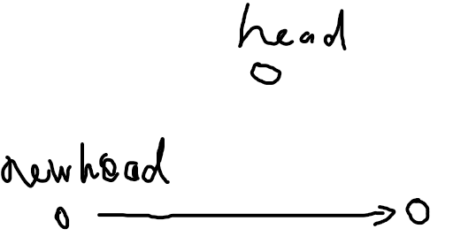
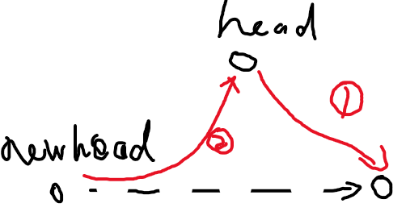
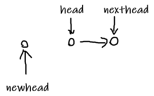
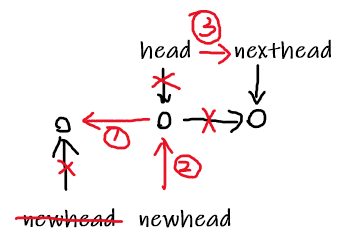

链表问题可以用递归来处理

# 1. 找出两个链表的交点

### 160. Intersection of Two Linked Lists (Easy)

编写一个程序，找到两个单链表相交的起始节点。

```
输入：intersectVal = 8, listA = [4,1,8,4,5], listB = [5,0,1,8,4,5], skipA = 2, skipB = 3
输出：Reference of the node with value = 8
输入解释：相交节点的值为 8 （注意，如果两个链表相交则不能为 0）。从各自的表头开始算起，链表 A 为 [4,1,8,4,5]，链表 B 为 [5,0,1,8,4,5]。在 A 中，相交节点前有 2 个节点；在 B 中，相交节点前有 3 个节点。
```

```java
/**
 * Definition for singly-linked list.
 * public class ListNode {
 *     int val;
 *     ListNode next;
 *     ListNode(int x) {
 *         val = x;
 *         next = null;
 *     }
 * }
 */
public class Solution {
    public ListNode getIntersectionNode(ListNode headA, ListNode headB) {
        ListNode l1 = headA,l2 = headB;
        while (l1!=l2){//相等的时候有可能是交点也有可能同时为null
            l1 = l1==null?headB:l1.next;
            l2 = l2==null?headA:l2.next;
        }
        return l1;
    }
}
```

思路: 要让两个指针同时到达交叉点, a+c+b+c = b+c+a+c, 最后一段的c处就会是同步进行的

# 2. 链表反转

### 206. Reverse Linked List (Easy)

反转一个单链表, 用迭代和递归两种方法

```java
/**
 * Definition for singly-linked list.
 * public class ListNode {
 *     int val;
 *     ListNode next;
 *     ListNode(int x) { val = x; }
 * }
 */
class Solution {
    //递归
    public ListNode reverseList(ListNode head) {
        if (head == null || head.next == null) {
            return head;
        }
        ListNode next = head.next;
        ListNode newHead = reverseList(next);
        next.next = head;
        head.next = null;
        return newHead;
    }
    //头插法
    public ListNode reverseList2(ListNode head) {
        ListNode newHead = new ListNode(-1);
        while (head != null) {
            ListNode next = head.next;//把next节点领出来
            head.next = newHead.next;//将head的下一个节点改成与newhead的下一个节点相同
            newHead.next = head;//将newhead的下一个节点修改位head
            head = next;//next节点成为新的head/新的将插入的节点
        }
        return newHead.next;
    }
}
```





思路:

递归: 

​	递归结束: head.next为null时结束, 返回head为链表头部

​	递归过程: 输入head, 取得head的next, 取得递归链表头, 修改next的指向为head, 修改head的指向为null, 返回递归链表头

头插: 建一个新的节点为新链表的头部, 插入head:  取得head的下一个节点暂存为next, 修改head的指向与newhead的指向相同, 修改newhead的指向为head, 修改head( 下一个欲插入的点) 为next, 循环直到head为空

# 3. 归并两个有序的链表

### 21. Merge Two Sorted Lists (Easy)

将两个升序链表合并为一个新的 **升序** 链表并返回。新链表是通过拼接给定的两个链表的所有节点组成的。 

```java
public ListNode mergeTwoLists(ListNode l1, ListNode l2) {
    if (l1 == null) return l2;
    if (l2 == null) return l1;
    if (l1.val < l2.val) {
        l1.next = mergeTwoLists(l1.next, l2);//递归处理
        return l1;//返回链表头
    } else {
        l2.next = mergeTwoLists(l1, l2.next);
        return l2;
    }
}
```

思路: 

当l1为空返回l2, 反之返回l1;

当l1.val小于l2.val时, 修改l1的指向, 递归处理l1.next与l2; 另一种情况处理l2

# 4. 从有序链表中删除重复节点

### 83. Remove Duplicates from Sorted List (Easy)

给定一个排序链表，删除所有重复的元素，使得每个元素只出现一次。

```
输入: 1->1->2
输出: 1->2
```

```java
public ListNode deleteDuplicates(ListNode head) {
    if (head == null || head.next == null) return head;//递归结束
    head.next = deleteDuplicates(head.next);
    return head.val == head.next.val ? head.next : head;
}
```

思路:

递归; , 判断递归结束: head或者head.next为空时,结束

head与后一个结点判断是否相等, 后一个结点取自递归处理后的节点头

# 5. 删除链表的倒数第 n 个节点

### 19. Remove Nth Node From End of List (Medium)

给定一个链表，删除链表的倒数第 *n* 个节点，并且返回链表的头结点。

```
给定一个链表: 1->2->3->4->5, 和 n = 2.

当删除了倒数第二个节点后，链表变为 1->2->3->5.
```

**进阶：**

你能尝试使用一趟扫描实现吗？

```java
/**
 * Definition for singly-linked list.
 * public class ListNode {
 *     int val;
 *     ListNode next;
 *     ListNode(int x) { val = x; }
 * }
 */
class Solution {
    public ListNode removeNthFromEnd(ListNode head, int n) {
        ListNode fast = head;//设置快指针
        while (n-- > 0) {//快指针前进n格
            fast = fast.next;//移动指针
        }
        if (fast == null) return head.next;//如果指针移动了n=link.length的距离, 直接返回第二个, 说明删除的是第一个数
        ListNode slow = head;
        while (fast.next != null) {//当快指针还没到尾, 同时移动两个指针
            fast = fast.next;
            slow = slow.next;
        }
        slow.next = slow.next.next;//删除结点
        return head;
    }
}
```

思路: 设置**一个快指针和一个慢指针**, 快指针前进n格, 这样就和慢指针相距n-1格,, 然后两个指针**一起前进**, 直到快指针为空, 慢指针的位置就是要删的位置, 删除此位置的指针 

# 6. 交换链表中的相邻结点

### 24. Swap Nodes in Pairs (Medium)

给定一个链表，两两交换其中相邻的节点，并返回交换后的链表。

**你不能只是单纯的改变节点内部的值**，而是需要实际的进行节点交换。

```
给定 1->2->3->4, 你应该返回 2->1->4->3.
```

```java
/**
 * Definition for singly-linked list.
 * public class ListNode {
 *     int val;
 *     ListNode next;
 *     ListNode(int x) { val = x; }
 * }
 */
class Solution {
    public ListNode swapPairs(ListNode head) {
        if(head == null||head.next==null){
            return head;
        }
        ListNode nextOfNext = head.next.next;
        ListNode next = head.next;
        next.next = head;
        head.next = swapPairs(nextOfNext);
        return next;
    }
}
```

思路: 递归

递归终点: head和head.next 为空时结束

储存第三个节点, 修改第二个节点的后指向为第一个节点, 修改第一个节点的后指向为第二个节点原本的指向(指向第三个节点, 这里使用递归调用返回的节点) , 返回第二个节点因为它是节点头

# 7. 链表求和

### 445. Add Two Numbers II (Medium)

给你两个 非空 链表来代表两个非负整数。数字最高位位于链表开始位置。它们的每个节点只存储一位数字。将这两数相加会返回一个新的链表。

你可以假设除了数字 0 之外，这两个数字都不会以零开头。

进阶：

如果输入链表不能修改该如何处理？换句话说，你不能对列表中的节点进行翻转。

```
输入：(7 -> 2 -> 4 -> 3) + (5 -> 6 -> 4)
输出：7 -> 8 -> 0 -> 7
```

```java
class Solution {
    public ListNode addTwoNumbers(ListNode l1, ListNode l2) {
        Stack<Integer> l1Stack = buildStack(l1);
        Stack<Integer> l2Stack = buildStack(l2);
        ListNode head = new ListNode(-1);
        int carry = 0;//进位
        while (!l1Stack.isEmpty() || !l2Stack.isEmpty() || carry != 0) {
            int x = l1Stack.isEmpty() ? 0 : l1Stack.pop();
            int y = l2Stack.isEmpty() ? 0 : l2Stack.pop();
            int sum = x + y + carry;
            ListNode node = new ListNode(sum % 10);
            node.next = head.next;//头插法, 将head后面的抢夺到node后面
            head.next = node;//将node加入到head后面
            carry = sum / 10;
        }
        return head.next;
    }

    private Stack<Integer> buildStack(ListNode l) {
        Stack<Integer> stack = new Stack<>();
        while (l != null) {
            stack.push(l.val);
            l = l.next;
        }
        return stack;
    }
}
```

思路: 使用栈可以处理最后进入的节点/ 使用栈可以同步最后节点

buildStack: 建立栈, 当head不为空时, 入栈, 然后改变head为下一个节点

main: 获取两个链表的栈, 当栈不为空/进位不为空时, x为栈顶元素值或为0, y同理, 然后相加xy和进位carry, 新建node头插法( node抢夺head后面的节点, 然后node接入到head的后面 )插入, node值为sum%10, carry值为sum/10,  最后返回head的next

# 8. 回文链表

### 234. Palindrome Linked List (Easy)

请判断一个链表是否为回文链表。

**进阶：**
你能否用 O(n) 时间复杂度和 O(1) 空间复杂度解决此题？

```
输入: 1->2->2->1
输出: true
```

```java
class Solution {
    public boolean isPalindrome(ListNode head) {
        if (head == null || head.next == null) return true;
        //使用快慢指针, 快指针走两格, 慢指针走一格
        ListNode slow = head, fast = head.next;
        while (fast != null && fast.next != null) {//当还没走到尾部或者尾部后一个空位置时, 这里用 and 因为当fast在最后一个时(没有下一个)要结束循环了
            slow = slow.next;
            fast = fast.next.next;
        }
        if (fast != null) slow = slow.next;  // 偶数节点，让 slow 指向下一个节点
        cut(head, slow);                     // 切成两个链表
        return isEqual(head, reverse(slow));
    }

    private void cut(ListNode head, ListNode cutNode) {
        while (head.next != cutNode) {//head的下一个节点不等于cutNode时移动节点, head指针会停留在cutNode前一个
            head = head.next;
        }
        head.next = null;//切断node点后的链接
    }

    private ListNode reverse(ListNode head) {
        ListNode newHead = null;
        while (head != null) {
            //非头插, 纯反转节点
            //newhead意为新链头
            //保存next节点, 修改head指向newhead, 修改newhead为head, 修改head为head的next节点, 返回newhead
            ListNode nextNode = head.next;
            head.next = newHead;
            newHead = head;
            head = nextNode;
        }
        return newHead;
    }

    private boolean isEqual(ListNode l1, ListNode l2) {//输入两个链表头, 判断值是否相等, 程序隐含保证l1,l2长度一致
        while (l1 != null && l2 != null) {
            if (l1.val != l2.val) return false;
            l1 = l1.next;
            l2 = l2.next;
        }
        return true;
    }
}
```

思路: 切成两半，把后半段反转，然后比较两半是否相等。

获取中间值的方法: 快慢指针, fast = head.next, slow = head, 快指针前进两格慢指针前进一格, 当fast不为空( 1 [2 3 3 2 1]) 即为偶数节点数, slow向后移动一格

切断的方法: 输入head头结点, 输入切段位置, 包含切断位置和之后的节点都消失;  当head.next!=cutNode时, 移动指针; 最后指针移动到cutNode前一个节点, 修改next为null, 不用返回

反转的方法: 当节点为空或者只有一个时直接返回; 当head不为空时:  存储head的next的节点, 修改head指向newhead, 修改newhead为head, 修改head为nexthead; 最后返回newhead





判断相等的方法: 当两个链表头都不为空时: 判断值相等不, 不就返回false; 同时移动指针; 最后返回true

# 9. 分隔链表

### 725. Split Linked List in Parts(Medium)

给定一个头结点为 root 的链表, 编写一个函数以将链表分隔为 k 个连续的部分。

每部分的长度应该尽可能的相等: 任意两部分的长度差距不能超过 1，也就是说可能有些部分为 null。

这k个部分应该按照在链表中出现的顺序进行输出，并且排在前面的部分的长度应该大于或等于后面的长度。

返回一个符合上述规则的链表的列表。

举例： 1->2->3->4, k = 5 // 5 结果 [ [1], [2], [3], [4], null ]

- `root` 的长度范围： `[0, 1000]`.
- 输入的每个节点的大小范围：`[0, 999]`.
- `k` 的取值范围： `[1, 50]`

```
输入: 
root = [1, 2, 3], k = 5
输出: [[1],[2],[3],[],[]]
解释:
输入输出各部分都应该是链表，而不是数组。
例如, 输入的结点 root 的 val= 1, root.next.val = 2, \root.next.next.val = 3, 且 root.next.next.next = null。
第一个输出 output[0] 是 output[0].val = 1, output[0].next = null。
最后一个元素 output[4] 为 null, 它代表了最后一个部分为空链表。
```

```java
class Solution {
    public ListNode[] splitListToParts(ListNode root, int k) {
        int N = 0;
        ListNode cur = root;
        while (cur != null) {
            N++;//计数
            cur = cur.next;
        }
        int mod = N % k;
        int size = N / k;
        ListNode[] ret = new ListNode[k];//将返回的k个链表头
        cur = root;
        for (int i = 0; cur != null && i < k; i++) {
            ret[i] = cur;//设置头结点到组内
            int curSize = size + (mod-- > 0 ? 1 : 0);//计算每组的大小
            for (int j = 0; j < curSize - 1; j++) {//遍历,从1号开始移动size-1次
                cur = cur.next;//按组大小移动头结点
            }
            ListNode next = cur.next;//保存next
            cur.next = null;//切段cur后面的联系
            cur = next;//移动cur指针到下一个, 然后开始下一组
        }
        return ret;
    }
}
```

思路: 遍历一次取得链表大小, 除k得基础size, 取模得多余的, 遍历存头结点cur入组内, 移动cur到组尾, 切断后面的联系, 修改cur到下一组开头, 返回头结点组

# 10. 链表元素按奇偶聚集

### 328. Odd Even Linked List (Medium)

给定一个单链表，把所有的奇数节点和偶数节点分别排在一起。请注意，这里的奇数节点和偶数节点指的是节点编号的奇偶性，而不是节点的值的奇偶性。

请尝试使用原地算法完成。你的算法的空间复杂度应为 O(1)，时间复杂度应为 O(nodes)，nodes 为节点总数。

- 应当保持奇数节点和偶数节点的相对顺序。
- 链表的第一个节点视为奇数节点，第二个节点视为偶数节点，以此类推。

```
输入: 1->2->3->4->5->NULL
输出: 1->3->5->2->4->NULL
```

```java
class Solution {
    public ListNode oddEvenList(ListNode head) {
        if (head == null) {
            return head;
        }
        ListNode odd = head, even = head.next, evenHead = even;
        while (even != null && even.next != null) {
            //尾插法
            odd.next = odd.next.next;//next指向下下个
            odd = odd.next;//修改odd指针为下一个
            even.next = even.next.next;//next指向下下个
            even = even.next;
        }
        odd.next = evenHead;//将偶链接头接在奇的尾部
        return head;
    }
}
```

思想: 拿1,2 作为奇偶结点头, 用尾插法插入他们的尾部, 最后2结点接入到奇的尾部, 返回1


