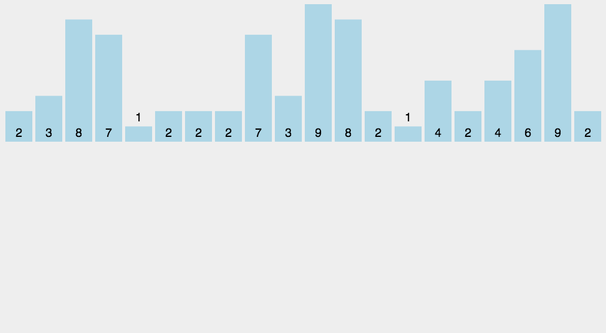

# 1. 冒泡排序 Bubble Sort

## 大的往后换

算法描述:

1. 比较相邻元素, 如果第一个比第二个大, 就交换

2. 对每一个相邻元素做比较,一直到最后一个

3. 重复以上步骤, 减去最后一个

4. 重复以上步骤直到完成

   

   ```java
   public static int[] bubbleSort(int[] array){//此冒泡排序为升序
       if(array.length==0){
           return array;
       }
       for(int i = 0; i<array.length; i++){//比较趟数等于数组总长度
           for(int j = 0; j<array.length-1-i;j++){//每过一趟就排好一个数,少比较一个数,减掉趟数
               if(array[j+1]<array[j]){//当前面大时要交换
                   int temp = array[j+1];
                   array[j + 1] = array[j];
                   array[j] = temp;
               }
           }
       }
       return array;
   }
   ```

   代码思路:

   1. 判断数组长度,为空直接返回
   2. 外循环为比较趟数,内循环为每趟比较次数
   3. 每过一趟就少比较一个数
   4. 当前面大时就要交换
   5. 返回数组


# 2. 选择排序 Selection Sort

## 选小入坑

算法描述:

1. 第一趟从前往后选出这一趟中最小的数,填入一号坑位中

2. 第二趟从前往后(除开第一个已经选出的数), 选出这一趟最小的数,填入二号坑

3. 循环选出最小的数填入对应坑位中直到完成

   

```java
public static int[] selectionSort(int[] array) {
    if (array.length == 0)
        return array;
    for (int i = 0; i < array.length; i++) {//趟数等于数组个数,也就是坑位的个数,i为该趟坑位号
        int minIndex = i;//只是一个暂时的选择,作为参照数,选了最开始的一个数
        for (int j = i; j < array.length; j++) {//从坑位号码开始到结尾
            if (array[j] < array[minIndex]) //找到最小的数
                minIndex = j; //将最小数的索引保存
        }
        int temp = array[minIndex];//交换入坑
        array[minIndex] = array[i];
        array[i] = temp;
    }
    return array;
}
```

代码思路:

1. 判断是否为空数组
2. for循环,循环填坑,坑位数为数组长度
3. 取坑位上的数做参照,循环取后面的数来比较
4. 小于参照数的就保存索引
5. 这一趟比较完后交换


# 3. 插入排序 Insertion Sort

## 抽出插入

算法描述:

1. 默认第一个已经拍好序,拿第二个与前一个比较,小于则前一个数往后挪动

2. 再比较更前一个数,小于则挪动,大于则放入上一个挪动的数原来的位置

3. 直到最后一个数也插入完毕

   

```java
public static int[] insertionSort(int[] array) {
    if (array.length == 0)
        return array;
    int current;
    for (int i = 0; i < array.length - 1; i++) {//要处理的数的个数=趟数=数组长度-1
        current = array[i + 1];//拿i的后一个数
        int preIndex = i;//拿来比较的数的索引,从i开始,往前
        while (preIndex >= 0 && current < array[preIndex]) {//当比较还没到头而且前一个比后一个大时
            array[preIndex + 1] = array[preIndex];//前一个往后挪
            preIndex--;//改变索引,比较再前一个数
        }
        array[preIndex + 1] = current;//上面循环打破,说明找的位置了,放在比较的数的后面
    }
    return array;
}
```

代码思路:

1. 判数组空
2. 给要排序的数留一个场外空间
3. 外循环:要处理的数的个数=趟数=数组长度-1
4. 把后面的数取出到场外空间,把前一个数的索引记录下来
5. 循环比较,还没比较到头而且前一个比后一个大:前一个后挪一位,改变索引,再比较更前一个
6. 循环打破,找到位置,插入到比较数的索引的后一个位置


# 4. 希尔排序 Shell Sort

## 隔位分组插入排序

算法描述:

1. 每隔length/2个数为一组,组内插入排序
2. 缩小间隔为length/2/2,组内插入排序
3. 直到间隔为1,组内插入排序
4. 减少了数的移动


```java
public static int[] ShellSort(int[] array) {
    int len = array.length;
    int temp, gap = len / 2;//设置间隔
    while (gap > 0) {//当间隔为1时再除2就成0了,结束循环
        for (int i = gap; i < len; i++) {//有gap组,每组len-gap个数,要排这么多个数
            temp = array[i];//取出待排的数
            int preIndex = i - gap;
            while (preIndex >= 0 && array[preIndex] > temp) {//大于比较数时后移
                array[preIndex + gap] = array[preIndex];//间隔gap个位置
                preIndex -= gap;//索引前移gap个
            }
            array[preIndex + gap] = temp;//小于时不用后移,插入到后面的位置
        }
        gap /= 2;//减小间隔
    }
    return array;
}
```

代码思路:

1. 全局len存数组长度,temp存待插数,gap存间隔
2. while间隔大于0
3. 循环,有gap组,每组len-gap个数
4. 取出待排数,取出起始待比较数的索引
5. 循环比较,间隔gap个位置,索引前移gap个
6. 插入到位
7. 减小间隔


# 5. 归并排序 Merge Sort

## 递归比较子序列头大小

算法描述:

1. 长度为n的分成n/2的子序列

2. 子序列归并排序

3. 将排序好的子序列合并成最终序列

   

```java
public static int[] MergeSort(int[] array) {//递归归并
    if (array.length < 2) return array;
    int mid = array.length / 2;
    int[] left = Arrays.copyOfRange(array, 0, mid);
    int[] right = Arrays.copyOfRange(array, mid, array.length);
    return merge(MergeSort(left), MergeSort(right));
}
/**
     * 归并排序——将两段排序好的数组结合成一个排序数组
     *
     * @param left
     * @param right
     * @return
     */
public static int[] merge(int[] left, int[] right) {//归并合并方法
    int[] result = new int[left.length + right.length];//最终归并后的总长度
    for (int index = 0, i = 0, j = 0; index < result.length; index++) {
        if (i >= left.length)//左列放完了,右列逐一放入剩下的坑位
            result[index] = right[j++];
        else if (j >= right.length)//右列放完了,左列逐一放入剩下的坑位
            result[index] = left[i++];
        else if (left[i] > right[j])//左头大,拿右头放入坑位
            result[index] = right[j++];
        else
            result[index] = left[i++];//右头大,拿左头放入坑位
    }
    return result;
}
```

代码思路:

1. 递归方法MergeSort,当长度小于2结束递归返回数组
2. 取中间值,取左子列copyOfRange,右子列,递归调用MergeSort方法
3. merge方法合并数组
4. merge方法:设置归并后总长度
5. for循环,index坑位号, i左列比较序号,j右列比较序号,坑位号自增
6. if else判断:左列放完,右列放完,左头大,右头大


# 6. 快速排序 Quick Sort

算法描述:

1. 从数列中选一个元素作为基准pivot

2. 所有比基准小的放基准前面, 所有比基准大的放后面,此称分区操作

3. 递归的处理基准前后的两个序列

   

```java
public static int[] QuickSort(int[] array, int start, int end) {//快排主函数
    if (array.length < 1 || start < 0 || end >= array.length || start > end) return null;//判断是否有效参数
    int smallIndex = partition(array, start, end);//整体做快排,选出排好的基准/数
    if (smallIndex > start)//排好的 基准/数 前面还有元素的时候继续对前面的做快排
        QuickSort(array, start, smallIndex - 1);
    if (smallIndex < end)
        QuickSort(array, smallIndex + 1, end);
    return array;
}
/**
     * 快速排序算法——partition
     * @param array
     * @param start
     * @param end
     * @return
     */
public static int partition(int[] array, int start, int end) {
    int pivot = (int) (start + Math.random() * (end - start + 1));//取基准索引
    int smallIndex = start - 1;
    /**
     * smallIndex的作用: 尺量小于基准的数的个数=找到基准应该放的位置
     * int i 的作用: 用来探测全部元素的指针
     * 过程原理: 探针遇到小于基准的, 尺/池加一,遇到大的尺不动, 又遇到小的交换到前面去(SI位置,也是第一个比基准大的数的位置),不断的把小的换到前面,最后基准会被换到小和大的分界处, 返回基准位置, 这个数已经排好序.
     */
    swap(array, pivot, end);
    for (int i = start; i <= end; i++)
        if (array[i] <= array[end]) {
            smallIndex++;
            if (i > smallIndex)
                swap(array, i, smallIndex);
        }
    return smallIndex;
}

/**
     * 交换数组内两个元素
     * @param array
     * @param i
     * @param j
     */
public static void swap(int[] array, int i, int j) {
    int temp = array[i];
    array[i] = array[j];
    array[j] = temp;
}
```


快排三大方法名:

void swap(int[] array, int i, int j)

int partition(int[] array, int start, int end)

int[] quicksort(int[] array, int start, int end)


# 7. 堆排序 Heap Sort

算法描述:

1. 将待排序列构建成大顶堆,
2. 将堆顶元素与最后一个元素交换, 得到新无序取和新有序区
3. 调整新无序区为新大顶堆,再用堆顶元素与无序区最后一个元素交换,..
4. 不断重复直到排序完成


```java
public static void heapSort(int[] arr){
    if(arr.length < 1) throw new IllegalArgumentException("illegal argument");
    int end = arr.length - 1;
    buildHeap(arr);//建堆
    while(end > 0){
        swap(arr, 0, end);
        end--;
        adjust(arr, 0, end);
    }
}
public static void buildHeap(int[] arr){
    int len = arr.length;
    for(int i=len / 2 - 1; i>=0; i--){//长度/2减1个数需要调整
        adjust(arr, i, len-1);//i为调整的位置,建堆的调整是从最后一个非叶节点开始调
    }
}
public static void adjust(int[] arr, int i, int end){//数组, 调整位置, 结束位置
    //已建好堆的调整是从上往下调整, 整体上看是调整了一条路径上的数
    int maxIndex = i;
    if((i*2+1) <= end && arr[i*2+1] >= arr[maxIndex]) maxIndex = i*2+1;//左子树
    if((i*2+2) <= end && arr[i*2+2] >= arr[maxIndex]) maxIndex = i*2+2;//右子树
    if(maxIndex != i){//当最大数的指针不在调整数上
        swap(arr, maxIndex, i);
        adjust(arr, maxIndex, end);
    }
}
```


# 8. 计数排序 Counting Sort

计数排序的核心在于将输入的数据值转化为键存储在额外的数组空间, 要求输入的数据必须是有确定范围的整数


算法描述:

1. 找出待排数组中最大最小值

2. 统计数组中每个值的出现次数,将次数存入数组c的对应元素数值的位置上

3. 对所有计数累加

4. 反向填回目标数组,将元素放在第c[i]位置上, 每放一个c[i]减一(从后往前放)

   

```java
/**
 * 计数排序
 *
 * @param array
 * @return
 */
public static int[] CountingSort(int[] array) {
    if (array.length == 0) return array;
    int bias, min = array[0], max = array[0];
    for (int i = 1; i < array.length; i++) {//这里循环遍历数组取获取最大最小值
        if (array[i] > max)
            max = array[i];
        if (array[i] < min)
            min = array[i];
    }
    bias = 0 - min;//
    int[] bucket = new int[max - min + 1];//新建数组桶
    Arrays.fill(bucket, 0);//fill对bucket数组填充0
    for (int i = 0; i < array.length; i++) {
        bucket[array[i] + bias]++;//array[i]+bias, 把数的范围抬高到整数范围
    }
    int index = 0, i = 0;
    while (index < array.length) {//桶号也是元素值+偏离值
        if (bucket[i] != 0) {//i号桶不为空时, 放入
            array[index] = i - bias;//桶号减去偏离值即得原来的值
            bucket[i]--;//桶内个数减1
            index++;//处理下一个数组坑位
        } else
            i++;//i号桶为空, 处理下一个桶
    }
    return array;
}
```


# 9. 桶排序 Bucket Sort

算法描述:

1. 


```java
public static ArrayList<Integer> BucketSort(ArrayList<Integer> array, int bucketSize) {
    if (array == null || array.size() < 2)
        return array;
    int max = array.get(0), min = array.get(0);
    // 找到最大值最小值
    for (int i = 0; i < array.size(); i++) {
        if (array.get(i) > max)
            max = array.get(i);
        if (array.get(i) < min)
            min = array.get(i);
    }
    int bucketCount = (max - min) / bucketSize + 1;
    ArrayList<ArrayList<Integer>> bucketArr = new ArrayList<>(bucketCount);
    ArrayList<Integer> resultArr = new ArrayList<>();
    for (int i = 0; i < bucketCount; i++) {
        bucketArr.add(new ArrayList<Integer>());
    }
    for (int i = 0; i < array.size(); i++) {
        bucketArr.get((array.get(i) - min) / bucketSize).add(array.get(i));
    }
    for (int i = 0; i < bucketCount; i++) {
        if (bucketSize == 1) { // 如果带排序数组中有重复数字时
            for (int j = 0; j < bucketArr.get(i).size(); j++)
                resultArr.add(bucketArr.get(i).get(j));
        } else {
            if (bucketCount == 1)
                bucketSize--;
            ArrayList<Integer> temp = BucketSort(bucketArr.get(i), bucketSize);
            for (int j = 0; j < temp.size(); j++)
                resultArr.add(temp.get(j));
        }
    }
    return resultArr;
}
```


# 10. 基数排序 Radix Sort

算法描述:

1. 取数组中最大的数,并取得位数
2. arr为原数组,从最低位开始取每个位组成的radix数组
3. 对radix进行计数排序


```java
public static int[] RadixSort(int[] array) {
    if (array == null || array.length < 2)
        return array;
    // 1.先算出最大数的位数；
    int max = array[0];
    for (int i = 1; i < array.length; i++) {
        max = Math.max(max, array[i]);
    }
    int maxDigit = 0;
    while (max != 0) {
        max /= 10;
        maxDigit++;
    }
    int mod = 10, div = 1;
    ArrayList<ArrayList<Integer>> bucketList = new ArrayList<ArrayList<Integer>>();
    for (int i = 0; i < 10; i++)
        bucketList.add(new ArrayList<Integer>());
    for (int i = 0; i < maxDigit; i++, mod *= 10, div *= 10) {
        for (int j = 0; j < array.length; j++) {
            int num = (array[j] % mod) / div;
            bucketList.get(num).add(array[j]);
        }
        int index = 0;
        for (int j = 0; j < bucketList.size(); j++) {
            for (int k = 0; k < bucketList.get(j).size(); k++)
                array[index++] = bucketList.get(j).get(k);
            bucketList.get(j).clear();
        }
    }
    return array;
}
```


