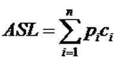

# 1. 查找定义

### 查找算法分类

- 静态查找和动态查找
  - 静态是值已经固定, 动态是查找时有插入删除操作
- 无序查找和有序查找
  - 被查数列原本有无序均可
  - 被查数列必须有序


### 平均查找长度（Average Search Length，ASL）



n为被查数列元素个数, pi为查找第i个元素的概率, 通常每个概率相同( pi = 1/n)

ci是查找到第i个元素的比较次数

**ASL越大时间性能越差**


# 2. 顺序查找

### 顺序查找的基本思想

- 顺序查找也叫线性查找-属于无序查找算法
- 从一端到另一端依次扫描
- 适合存储结构为顺序存储或链接存储的线性表


### 顺序查找的代码

```java
public class SequenceSearch {	
	/** 根据顺序查找的算法，返回在nums数组中key的index
	 * 直接在数组中遍历即可
	 * @param nums
	 * @param key
	 * @return 如果没有找到，返回-1
	 */
	public static int sequenceSearch(int[] nums,int key){
		for(int i=0;i<nums.length;i++){
			int now=nums[i];
			if(now==key){
				return i;
			}
		}	
		return -1;
	}
 
}
```


### 顺序查找的复杂度

成功:　ASL = 1/n(1+2+3+…+n) = (n+1)/2 ;

时间复杂度O(n)


# 3. 二分查找

### 二分查找的基本思想

- 也叫折半查找, 属于有序查找算法
- k值先与中间关键字比较, 中间关键字将表分成了两半, 递归查找子列的中间值
- 需要频繁插入和删除的表不建议使用


### 二分查找的代码

```java
public class BinarySearch {
	/** 用二分查找在nums数组中查找key的index
	 *  先用快排对数组进行排序，然后设定begin=0,end=length-1
	 * 	mid=(begin+end)/2,查找mid的值与key的大小
	 * 	如果相同，返回index
	 * 	如果mid<key,那么begin=mid+1，如果mid>key,那么end=mid-1
	 * 	然后循环，直到end<begin,返回-1
	 * @param nums
	 * @param key
	 * @return 如果数组中没有这个key，返回-1
	 */
	public static int binarySearch(int[] nums,int key){
		int length=nums.length;
		QuickSort.quickSort(nums, 0, length-1);
		//begin=0,end=length-1
		int begin=0;
		int end=length-1;
		//循环，直到end<begin,返回-1
		while(begin<=end){
			int mid=(begin+end)/2;
			int now=nums[mid];
			if(now==key){
				//如果相同，返回index
				return mid;
			}
			if(now<key){
				//如果mid<key,那么begin=mid+1
				begin=mid+1;
			}
			if(now>key){
				//如果mid>key,那么end=mid-1
				end=mid-1;
			}			
		}				
		return -1;
	}
 
}
```


### 二分查找的复杂度


# 4. 插值查找

### 插值查找的基本思想


### 插值查找的代码


### 插值查找的复杂度


# 5. 斐波那契查找

### 斐波那契查找的基本思想


### 斐波那契查找的代码


### 斐波那契查找的复杂度


# 6. 二叉树查找

### 二叉树查找的基本思想


### 二叉树查找的代码


### 二叉树查找的复杂度


# 7. 平衡查找树之2-3查找树（2-3 Tree）

### 2-3树的基本思想


### 2-3树的复杂度


# 8. 平衡查找树之红黑树（Red-Black Tree）

### 红黑树的基本思想


### 红黑树的代码


### 红黑树的复杂度


# 9. B树和B+树（B Tree/B+ Tree）

### B树和B+树的基本思想


### B树和B+树的复杂度


# 10. 树表查找总结


# 11. 分块查找

### 分块查找的基本思想


### 分块查找的代码


### 分块查找的复杂度


# 12. 哈希查找

### 哈希查找的基本思想


### 哈希查找的代码


### 哈希查找的复杂度


# 13. 查找总结


