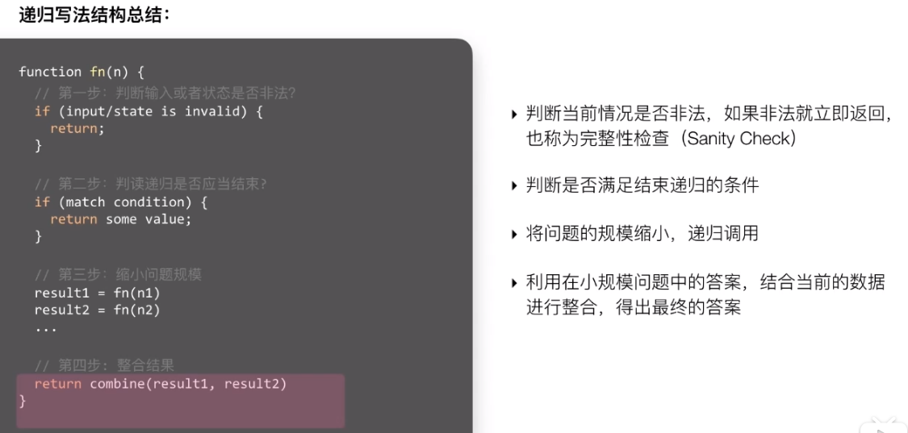

# 数据结构

## 数组, 字符串

数组优点: 构建简单, o(1)查询固定下标元素

缺: 构建需连续空间, 查询某元素是否存在要遍历

添加删除同样O(n)

## 链表

单链表: 不能下标快速查询, O(n)

O(1)删除和添加

解题技巧: 快慢指针( 有时要三个) 

在纸上画出节点之间的关系

# 栈

后进先出

可以用单链表来实现栈

只关心上一次操作

处理完上一次操作后, 能在O(1)时间内查找到更前一次的操作

## 队列

先进先出

双链表

当需要一定顺序时, 而且数据是不断变化的

**常用场景**

广度优先搜索

## 双端队列

利用双链表

队列头尾两端都能在O(1)时间内进行数据查看, 添加, 删除

**常用场景**

实现一个长度动态变化的窗口或连续区间

## 树

结构直观, 树问题大多为递归问题

**常见树**

普通二叉, 平衡二叉, 完全二叉, 二叉搜索, 四叉, 多叉, 红黑树, 自平衡二叉搜索

前中后序遍历

剪枝

# 高级数据结构

## 优先队列

与普通队列区别

保证每次取出的元素是优先级别最高的, 优先级可自定

**常用场景**

从杂乱无章的数据中按照一定的顺序或优先级筛选数据

**本质**

二叉堆的结构, 利用一个数组结构来实现完全二叉树

**特性**

数组第一个元素array[0]拥有最高优先级

对于元素array[i], 父节点下标: (i-1)/2

左子节点: 2\*i+1    右子节点: 2\*i+2

数组中每个元素的优先级都必须高于它两个子节点

**基本操作**

向上筛选 : 比较子父节点的优先级, 大的交换到上面, nlogn

向下筛选: 拿掉堆顶元素后要调整堆的过程

优先队列初始化 o(n)

解题: 用哈希表存单词出现次数, 用优先队列拿前k个高频元素(因为时间复杂度要优于nlogn)

## 图

**基本知识点**

阶, 度

## 前缀树

也称字典树

运用在字典查找中: 给定一系列构成字典的字符串, 在字典中要找出所有以"ABC"开头的字符串

**经典应用**

搜索关键词

## 线段树

## 树状数组

# 排序

面对算法面试

先想最直观的解法

直观解法大多不是最优解,但可以打通思路

根据问题核心来优化步骤

## 冒泡

从头部开始每两个比较大小并交换, 直到这一轮最大或最小的数放在数组尾部

不断重复直到所有都排好

空间O(1)

时间平均O(n)

稳定

## 插入排序

每一轮处理过后, 前端的数是排好序的

不断的将未排序的数插入到已经排好的部分

## 归并

## 快速

## 拓扑

# 递归, 回溯

递归: 函数调用本身 , 把大规模问题不断变小

回溯: 利用递归性质, 从起始点开始尝试, 有时需要返回一步或多步

## 递归

经典问题: 汉诺塔

## 回溯

