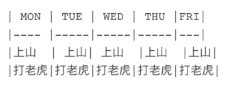

标题：#

字体：

​	加粗：**前后两个星号**

​	倾斜：*前后一个星号*

​	倾斜加粗：***前后三个星号***

​	删除线：~~前后两个弯弯~~

​	高亮：==前后两个等号==

​	上标： 我是 ^前后一个个上标符号^

​	下标：前后一个~弯弯~

加号加空格

空两格下一级

1点空格

表格

先竖线分割按回车就会变表格



| 表格1 | 表格2 | 表格三 |
| ----- | ----- | ------ |
|       |       |        |

引用 > 第一级,

两级用两个>>

单行代码`包裹

多行代码```包裹