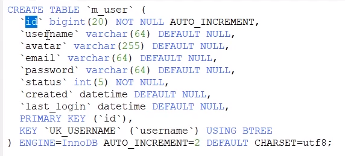
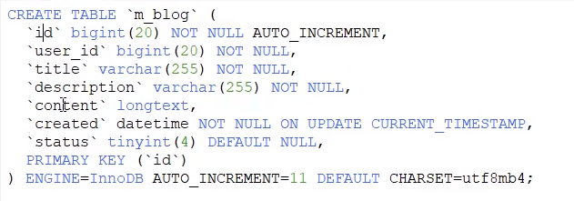
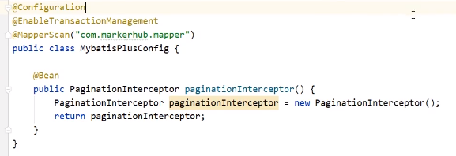
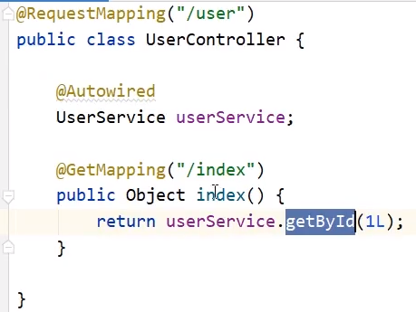

# 前后端分离的博客系统springboot+vue

> 使用到的技术栈: 
>
> ​	前端: vue, element-ui, axios
>
> ​	后端: Springboot , mybatis plus, shiro, redis, hibernate validatior, jwt
>
> 开发步骤: 
>
> 后端: 
>
> 1. springboot整合mybatis plus
> 2. 利用mybatis plus代码生成
> 3. 整合shiro+redis, 会话共享
> 4. shiro整合jwt, 身份校验
> 5. 统一结果封装
> 6. 实体校验
> 7. 解决跨域问题
> 8. 登录接口开发
> 9. 博客接口开发
>
> 前端:
>
> 1. vue整合element-ui, axios
>
>  	2. 登录页面
>  	3. 博客列表
>  	4. 博客详情


# 后端项目开发

## 1. 项目基础搭建

新建springboot项目, 勾选spring web, mysql驱动, 

整合mybatis plus依赖

```xml
spring boot 版本2.2.6
mybatis plus
freemarker
mysql-connector-java
mybatis-plus-generator # 3.2.0
```

编写application.properties配置文件

```
spring:
	datasource:
		driver-class-name: com.mysql.cj.jdbc.Driver
		url: jdbc:mysql://localhost:3306/vueblog?useUnicode=true&useSSL=false&characterEncoding=utf8&serverTimezone=Asia/shanghai
		username: root
		password: admin
mybatis-plus:
	mapper-locations: classpath*:/mapper/**Mapper.xml
server:
	port: 8081
```

数据库建表语句





新建config包, 新建MybatisPlusConfig配置类



配置代码生成类:CodeGenerator, 生成代码


测试接口

## 2. 统一结果封装

封装的结果类Result, 用于异步统一返回的结果封装, 一般有几个属性是必要的

- 是否成功, 可用code表示, 200表示成功, 400表示异常
- 结果消息
- 结果数据

新建common.lang包, 包下新建Result类

```java
@Data
public class Result implements Serializable{
    
}
```

