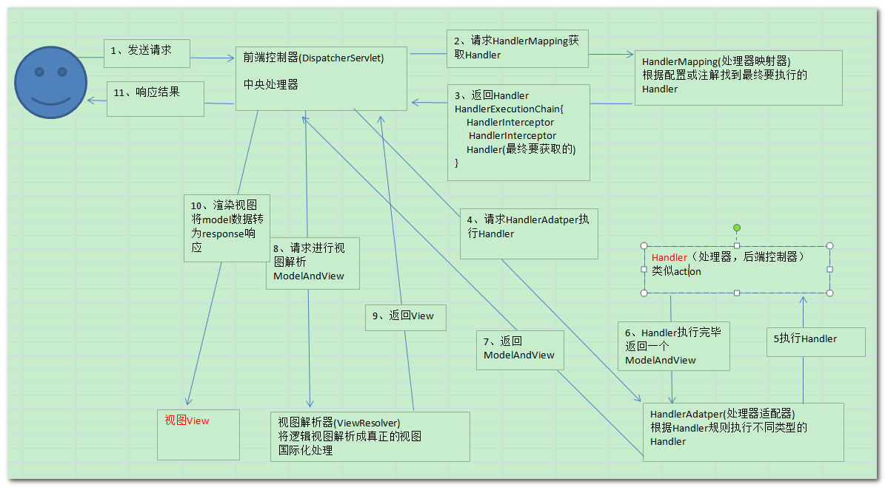
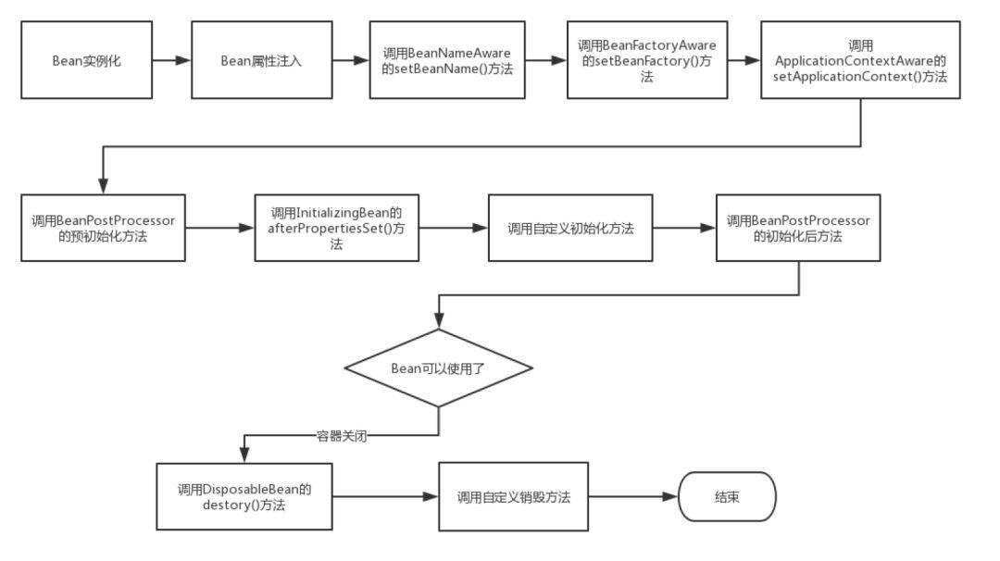

# java基础

## 自动装箱和拆箱

装箱: 基本数据类型->包装类:  Integer.valueOf(int)

拆箱: 包装类变基本数据类型:Integer.intValue

在通过valueOf方法创建Integer对象的时候，如果数值在[-128,127]之间，便返回指向IntegerCache.cache中已经存在的对象的引用；否则创建一个新的Integer对象。

## 重载与重写

重载: 同一个类中相同方法名, 有不同的参数, 返回值也可以不同

重写: 两个有继承关系的类中, 子类修改父类的方法, 修饰限定符不能比父类严格, 不能抛出父类没有的异常

## equals与==

equals是对比对象内容是否相同, 如果没有重写equals方法就是比较地址

==是对比变量内存地址是否相同, 判断一个对象是否等于另一个对象

## Hashcode作用

返回值就是根据对象地址计算的一个值, 当集合要添加元素时先调用hashcode方法定位地址, 有元素了就用equals比较对象是否相同, 不同再重新散列到新地址

## String、StringBuffer 和 StringBuilder 的区别是什么?

1是只读字符串, 是对象, 是final类型的字符数组, 引用的字符串不能被改变, 每次对String的操作会生成新的String对象

StringBuffer和StringBuilder他们两都继承了AbstractStringBuilder抽象类, 底层是可变字符数组, StringBuffer 对方法加了同步锁或者对调用的方法加了同步锁，所以是线程安全的

## ArrayList和linkedList的区别

Array是基于索引的数据结构, 搜索和读取速度很快, 删除元素需要移动后面的每一元素, 

List是一个有序集合, 可以包含重复元素, 提供了索引访问方式 , 继承自Collection

两个实现类:  ArrayList底层是数组,getset强, LinkedList底层是双链表, adddelete强

## HashMap和HashTable的区别 (视频)

父类, 方法, null, 安全, 容量, hash

父类不同:AbstractMap,Dictionary

对外提供的接口不同:Hashtable比HashMap多提供了elments() 和contains() 两个方法

对null支持不同: map的key可以为null而且只能有一个, table的ky都不能为null

安全性不同: map不安全table安全, map效率高, 可以使用ConcurrentHashMap是线程安全的, 也比table效率高(分段锁不是全部锁定), table每个方法上都有synchronized关键字

初始容量大小和扩容容量大小不同

计算hash值方法不同

## Collection包结构，与Collections的区别

Collection是集合类上级接口, 子接口有Set、List、LinkedList、ArrayList、Vector、Stack、Set；

Collections是集合类的一个工具类不能实例化,  用于实现对各种集合的搜索、排序、线程安全化等操作


## ArrayList和Vector的区别?

**时间**:ArrayList时JDK1.2开始提供的,Vector是从JDK1.0开始提供的.
**安全性**:ArrayList采取异步处理,性能较高,线程不安全,Vector采取同步处理,性能较低,线程安全.
输出形式:ArrayList支持Iterator, ListIterator, foreach ,Vector支持Iterator, ListIterator, foreach ,**Enumerator**.

## ArrayList和LinkedList的区别?

ArrayList基于动态数组实现,LinkedList基于链表实现.
对于随机访问get和set,ArrayList要优于LinkedList,因为LinkedList要移动指针,
对于添加(add)和删除(remove)操作LinkedList要优于ArrayList,因为ArrayList要移动数据.

## java四种引用

强弱软虚

强引用在OOM时也不会被回收: 正常的**new**的对象

软引用内存不足时会回收: new**匿名**对象

弱引用:jvm垃圾回收器发现就会回收

虚引用:被回收前会放入释放队列

## 对象创建的方法有几种

new, 反射, clone, 序列化机制

## 有没有可能两个不相等的对象有相同的hashcode

有可能, 发生hash冲突时要再散列: **拉链法**: 节点上挂单向链表, **开放定址法**:发生冲突找下一个空的散列地址, 再哈希: **双哈希法**, 

## 深拷贝和浅拷贝的区别

浅拷贝: 复制对象的变量, 对象中对其他对象的引用仍指向原来的对象

深拷贝: 复制对象的变量, 同时对引用的对象指向新的拷贝的对象

## final的用法

- 被final修饰的类不可以被**继承**
- 被final修饰的方法不可以被**重写**
- 被final修饰的变量不可以被**改变**.如果修饰引用,那么表示**引用不可变**,引用指向的内容可变.
- 被final修饰的方法,JVM会尝试将其**内联**,以提高运行效率
- 被final修饰的常量,在编译阶段会**存入常量池**中.

## static都有哪些用法

静态变量和静态方法, 实例共享

也用于静态块,多用于初始化操作

用于修饰内部类,此时称之为静态内部类

静态导包, 指定导入某个类中的静态资源, 可直接使用资源名

## a=a+b与a+=b有什么区别

`+=`操作符会进行隐式自动类型转换

## try catch finally，try里有return，finally还执行么

执行，并且finally的执行早于try里面的return

函数返回值是在finally执行前确定的

## Excption与Error包结构

运行时异常: 

被检查异常:

错误:

## OOM你遇到过哪些情况，SOF你遇到过哪些情况

除了程序计数器外，虚拟机内存的其他几个运行时区域都有发生OutOfMemoryError(OOM)异常的可能

Java **Heap 溢出**: java.lang.OutOfMemoryError:Java heap spacess, 不断创建对象,并保证不会被回收 , 对dump文件进行分析, 分清是内存泄漏还是内存溢出:泄漏就查看泄漏对象到GCRoots的引用链, 找到路径关联性导致的GC无法回收; 不是泄漏就设置-Xms与-Xms参数

虚拟机栈和本地方法栈溢出

如果线程请求的栈深度大于虚拟机所允许的最大深度，将抛出StackOverflowError异常。如果虚拟机在扩展栈时无法申请到足够的内存空间，则抛出OutOfMemoryError异常

运行时**常量池**溢出:  异常信息：java.lang.OutOfMemoryError:PermGenspace

**方法区**溢出: 异常信息：java.lang.OutOfMemoryError:PermGenspace

方法区中保存的class对象没有被及时回收掉或者class信息占用的内存超过了我们配置, 当程序中动态生成大量Class时要注意这一点

**SOF（堆栈溢出StackOverflow）：**

StackOverflowError 的定义：当应用程序递归太深而发生堆栈溢出时，抛出该错误。

栈溢出的原因：**递归**调用，大量循环或死循环，**全局变量**是否过多，数组、List、map数据过大。

## 简述线程、程序、进程的基本概念。以及他们之间关系是什么?

线程比进程更小的一个执行单位, 一个进程可以有多个线程, 同进程的线程**共享**内存空间和系统资源, cpu切换线程工作**开销小**

程序是含有指令和数据的文件, 存在硬盘, 也就是静态代码

进程是程序的执行过程, 是运行程序的基本单位, 

## 线程的基本状态


new runnable blocked waiting time_waiting terminated

当线程执行 `wait()`方法之后，线程进入 **WAITING（等待）**状态

通过 `sleep（long millis）`方法或 `wait（long millis）`方法可以将 Java 线程置于 TIMED WAITING 状态

线程在执行 Runnable 的`run()`方法之后将会进入到 TERMINATED（终止） 状态

## Java 序列化中如果有些字段不想进行序列化，怎么办

使用 **transient** 关键字修饰。transient 只能修饰变量，不能修饰类和方法

## Java 中 IO 流的分类?

流向:输入流输出流

操作单元: 字节流 , 字符流

流角色: 节点流和处理流

所有流都是由4个抽象类派生的: InputStream/Reader, OutputStream/Writer

File, Pipe, Array节点流, Buffered, InputStream, print处理流

按操作方式分类: 


按操作对象分类:


## 什么是NIO

java.nio=java non-blocking IO

原始类型  缓存  容器   非阻塞

为原始类型提供缓存的容器, 它可以提供非阻塞式的IO

#### 传统IO为什么是阻塞的, 面向流的?

无缓存, 使用read或write, 阻塞

传统IO是没有缓存的, 无法前后移动流内的数据, 当这个线程使用IO的read或write方法时, 该线程就会被阻塞直到IO结束

#### NIO为什么是面向块的, 非阻塞?

NIO有缓冲区 , 通道, 不需要等待

NIO通过通道发送读取请求, 当数据未可读取时线程可以做其他的事, 不会阻塞, 直到数据可读取, 线程才从通道中读取数据

#### NIO核心实现

通道, 缓冲 , 核心api: Channel, Buffer, Selector

通道Channel: 类似流,  同时读写, 异步读写, 可与缓冲交互

缓冲Buffer: 写入缓冲, buffer.flip()写读转换, 读取数据, buffer.clear()清空

交互标志:大小, 当前位置, 末尾

​	Buffer大小Capacity, 当前读写位置Position, 信息末尾位置limit


缓冲区操作:写入缓冲put方法, 读取缓冲get, 写转读pos=0,limit=pos,  clear vs compact: 清空全部和清空已读

Selector: 检测多个Channel, 注册

## Java IO与 NIO的区别

效率: NIO块方式处理, IO是字节流处理->NIO更快

方式: NIO用通道和缓冲区的形式处理数据

方向: NIO通道是双向的, IO流单向的

缓冲区: NIO缓冲区还可以分片: 只读缓冲区, 直接缓冲区, 间接缓冲区

核心区别:NIO采用多路复用的IO模型, 普通IO用的是阻塞的IO模型, 多路更高效

## java反射的作用与原理

反射: 运行时 获取信息 机制

动态获取信息以及动态调用对象的方法的功能成为java语言的反射机制

#### 哪里用到反射

jdbc加载驱动类

使用反射: 1. 获取Class对象

优缺点: 优: 1. 运行时动态获取类的实例, 灵活  2. 与动态编译结合  

缺: 1. 性能低, 需要解析字节码, 将内存中的对象进行解析  --->解决: 1. setAccessible(true)关闭JDK安全检查  2. 缓存  3. ReflectASM工具类, 通过字节码生成的方式加快反射

2.不安全, 破坏了封装性

## 说说List,Set,Map三者的区别？

List对付**顺序**好帮手, 可重复元素

Set注重**独**一无二, 不可重复元素

Map用**key搜索**的专家, 不可重复key


# JVM

内存模型, 性能调优, 执行模型, 编译器优化, 类加载, GC


#### 知识点

**内存模型**: 线程独占: 栈, 本地方法栈, 程序计数器   线程共享: 堆, 方法区

**栈**: 线程执行方法都会创建栈帧用来存放局部变量表, 操作栈,动态链接,方法出口等信息

**本地方法栈**: native方法

**程序计数器**: 保存当前线程执行位置, 每个线程独立

**堆**: 存放对象实例, 有GC

**方法区**: 存类信息, 常量, 静态变量===永久代, 元空间

**jvm内存可见性**: 线程->工作内存<->主内存

JMM需要提供原子性,可见性,有序性保证

## 类加载过程

加载, 验证, 准备, 解析, 初始化, 使用, 卸载

加载: 完全限定名, class文件, 创建Class对象

验证: 保证安全

准备: 内存分配, static, 设默认值, final则是在编译时分配 

解析: 常量池符号引用替换为直接引用

初始化: 静态块执行和静态变量赋值, 类使用时才会初始化(new, staic, 反射, 子类初始化)

**加载机制-双亲委派机制**: 优点: 避免核心api被修改, 避免重复加载

**分代回收**: 年轻代, 标记-复制, 老年代: 标记-清除

**回收算法**:

​	G1算法,1.9默认, 特点: 高回收率, 减少停顿, 每次清一点

​		取消年轻代与老年代物理划分, 分成逻辑区域

​	ZGC算法


# 多线程&并发

## 实现多线程有几种方法

4种, 

1. 继承Thread类, 
2. 实现Runnable接口, 
3. 实现Callable接口通过FutureTask创建线程, 
4. 使用ExecutorService  Callable   Future实现有返回结果的多线程

## 如何停止一个线程

1. 退出标志while(stop), run方法结束
2. stop强行终止, 不推荐
3. interrupt方法中断

## notify()和notifyAll()有什么区别？

notify()可能会死锁, 只唤醒一个, notifyAll()唤醒全部处于wait()的线程, 重新进入竞争

wait()配合while循环使用

## sleep()与wait()有什么区别

1. 属于Thread类, 线程暂停, 让出cpu, 不会释放对象锁
2. 属于Object类, 线程放弃对象锁, 进入等待锁定池, 只有调用notify()方法才能进入准备状态

## volatile 是什么?可以保证有序性吗?

关键字, 操作可见性, 禁止指令重排, 不保证原子性

添加到共享变量前的关键字, 有两个语义: 操作可见, 禁止指令重排

用于 状态标记量 单例模式的双检锁

## Thread 类中的start() 和 run() 方法有什么区别？

start(): 启动线程, 内部调用run()

run(): 被当成普通方法调用, 没有启动新线程

## 为什么wait, notify 和 notifyAll这些方法不在thread类里面？

**对象才有锁**, wait, notify, notifyAll都是操作对象的锁, 让出锁, 竞争锁, 

每个对象都有锁，通过线程获得。如果**线程需要**等待某些锁那么调用对象中的wait()方法就有意义了

由于wait，notify和notifyAll都是锁级别的操作，所以把他们定义在Object类中因为锁属于对象

## 为什么wait和notify方法要在同步块中调用？

1. 只有在调用线程拥有某个对象的独占锁时，才能够调用该对象的wait(),notify()和notifyAll()方法。
2. 如果你不这么做，你的代码会抛出IllegalMonitorStateException异常。
3. 还有一个原因是为了避免wait和notify之间产生竞态条件

wait()方法强制当前线程释放对象锁。这意味着在调用某对象的wait()方法之前，当前线程必须已经获得该对象的锁

## Java中interrupted 和 isInterruptedd方法的区别？

interrupted() 和 isInterrupted()的主要区别是前者会将**中断状态清除**而后者不会

Java多线程的中断机制是用内部标识来实现的，调用Thread.interrupt()来中断一个线程就会设置中断标识为true

## Java中synchronized 和 ReentrantLock 有什么不同？

相似: 加锁方式同步, 都是阻塞式同步,

区别:前者是关键字, 需要jvm实现, 后者是类, 需要使用lock()和unlock()方法配合trycatch

前者编译后会在同步块前后形成monitorenter和monitorexit这个两个字节码指令, 执行该指令时会尝试获取对象锁, 获得后对象锁计数器加一, 获取失败就要阻塞到释放为止

后者: 1, 等待可中断, 2, 可公平锁, 默认非公平, 3, 锁可绑定多个条件

## 有三个线程T1,T2,T3,如何保证顺序执行？

方法很多, 可以用线程类的join()方法在一个线程中启动另一个线程

## SynchronizedMap和ConcurrentHashMap有什么区别？

SynchronizedMap()和Hashtable一样，实现上在调用map所有方法时，都对整个map进行同步。所以，只要有一个线程访问map，其他线程就无法进入map，

ConcurrentHashMap的实现却更加精细，它对map中的所有桶加了锁。如果一个线程在访问ConcurrentHashMap某个桶时，其他线程，仍然可以对map执行某些操作

ConcurrentHashMap在性能以及安全性方面，明显比Collections.synchronizedMap()更加有优势

## 什么是线程安全

线程安全就是说**多线程访问**同一代码，不会产生**不确定**的结果。

多线程下如果变量都不是共享变量, 那么一定是线程安全的, 但是这情况不多见, 多数情况是需要共享变量的, 这时需要同步控制了

## Thread类中的yield方法有什么作用？

可以暂停当前正在执行的线程, 让其他优先级高的线程执行, 它只保证当前线程放弃占用cpu, 不保证其他线程一定能占用cpu

## Java线程池中submit() 和 execute()方法有什么区别？

都可以向线程池提交任务, 前者可以返回持有计算结果的Future对象, 它定义在ExecutorService接口, 扩展了Executor接口

后者返回类型是void, 它定义在Executor接口中

## 说一说自己对于 synchronized 关键字的了解

synchronized关键字解决多个线程之间访问资源的同步性, 可以保证被它修饰的方法或代码块在任意时间只有一个线程在运行;  早期java版本中, synchronized是重量级锁, 效率低, 因为监视器锁monitor是依赖底层操作系统的MutexLock来实现的, java线程是映射到操作系统原生线程上的, 原生线程切换线程的时候要从用户态转变为内核态, 这个转换过程是相对耗时的, 这就是synchronized效率低的原因;  java6以后java从jvm底层堆synchronized做优化, 现在效率也还可以, JDK1.6对锁的实现引入了大量的优化，如自旋锁、适应性自旋锁、锁消除、锁粗化、偏向锁、轻量级锁等技术来减少锁操作的开销。

## 说说自己是怎么使用 synchronized 关键字，在项目中用到了吗synchronized关键字最主要的三种使用方式：

修饰实例方法: 相当于当前对象加锁, 

修饰静态方法: 相当于当前类加锁, 

修饰代码块: 相当于当前对象加锁

如果一个线程调用实例对象非静态方法, 另一个线程调用静态方法, 是允许的, 不会发生互斥

##### 成员锁

锁的对象是变量

```java
public Object synMethod(Object a1) {
    synchronized(a1) {
        // 操作
    }
}
```

##### 实例对象锁

this 代表当前实例

```java
synchronized(this) {
    for (int j = 0; j < 100; j++) {
		i++;
    }
}
```

##### 当前类的 class 对象锁

```java
synchronized(AccountingSync.class) {
    for (int j = 0; j < 100; j++) {
        i++;
    }
}
```

## 什么是可重入锁

##### 含义

所谓可重入锁，指的是以线程为单位，当一个线程获取对象锁之后，这个线程可以再次获取本对象上的锁，而其他的线程是不可以的。（同一个加锁线程自己调用自己不会发生死锁情况）

##### 意义

防止死锁。

##### 实现原理

通过为每个锁关联一个请求计数和一个占有它的线程。当计数为 0 时，认为锁是未被占有的。线程请求一个未被占有的锁时，jvm 将记录锁的占有者，并且将请求计数器置为 1 。如果同一个线程再次请求这个锁，计数将递增；每次占用线程退出同步块，计数器值将递减。直到计数器为0,锁被释放。

##### 应用

synchronized 和 ReentrantLock 都是可重入锁。

ReentrantLock 表现为 API 层面的互斥锁（lock() 和 unlock() 方法配合 try/finally 语句块来完成），synchronized 表现为原生语法层面的互斥锁。

## 什么是线程安全？Vector是一个线程安全类吗？

如果你的代码所在的进程中有多个线程在同时运行，而这些线程可能会同时运行这段代码。如果每次运行结果和单线程运行的结果是一样的，而且其他的变量 的值也和预期的是一样的，就是线程安全的。

Vector 是用同步方法来实现线程安全的, 而和它相似的ArrayList不是线程安全的。

## volatile关键字的作用？

共享变量被volatile修饰后, 有两层语义:

1. 操作可见性
2. 禁止指令重排

## 常用的线程池有哪些？

- newSingleThreadExecutor：创建一个**单线程**的线程池，此线程池保证所有任务的执行顺序按照任务的提交顺序执行。
- newFixedThreadPool：创建**固定大小**的线程池，每次提交一个任务就创建一个线程，直到线程达到线程池的最大大小。
- newCachedThreadPool：创建一个**可缓存**的线程池，此线程池不会对线程池大小做限制，线程池大小完全依赖于操作系统（或者说JVM）能够创建的最大线程大小。
- newScheduledThreadPool：创建一个**大小无限**的线程池，此线程池支持定时以及周期性执行**任务**的需求。
- newSingleThreadExecutor：创建一个**单线程**的线程池。此线程池支持定时以及周期性执行**任务**的需求。

## 简述一下你对线程池的理解

线程池如何用、线程池的好处、线程池的启动策略

第一：降低资源消耗。通过重复利用已创建的线程降低线程创建和销毁造成的消耗。

第二：提高响应速度。当任务到达时，任务可以不需要等到线程创建就能立即执行。

第三：提高线程的可管理性。线程是稀缺资源，如果无限制的创建，不仅会消耗系统资源，还会降低系统的稳定性，使用线程池可以进行统一的分配，调优和监控。

## **双重校验锁实现对象单例（线程安全）**

```java
public class Singleton {

    private volatile static Singleton uniqueInstance;

    private Singleton() {
    }

    public static Singleton getUniqueInstance() {
       //先判断对象是否已经实例过，没有实例化过才进入加锁代码
        if (uniqueInstance == null) {
            //类对象加锁
            synchronized (Singleton.class) {
                if (uniqueInstance == null) {
                    uniqueInstance = new Singleton();
                }
            }
        }
        return uniqueInstance;
    }
}
```

uniqueInstance = new Singleton(); 这段代码其实是分为三步执行：

1. 为 uniqueInstance 分配内存空间
2. 初始化 uniqueInstance
3. 将 uniqueInstance 指向分配的内存地址

但是由于 JVM 具有指令重排的特性，执行顺序有可能变成 1->3->2。指令重排在单线程环境下不会出先问题，但是在多线程环境下会导致一个线程获得还没有初始化的实例。例如，线程 T1 执行了 1 和 3，此时 T2 调用 getUniqueInstance() 后发现 uniqueInstance 不为空，因此返回 uniqueInstance，但此时 uniqueInstance 还未被初始化。

使用 volatile 可以禁止 JVM 的指令重排，保证在多线程环境下也能正常运行。

## 讲一下 synchronized 关键字的底层原理

**synchronized 同步语句块的情况**

monitorenter/monitorexit

**synchronized 同步语句块的实现使用的是 monitorenter 和 monitorexit 指令，其中 monitorenter 指令指向同步代码块的开始位置，monitorexit 指令则指明同步代码块的结束位置。** 当执行 monitorenter 指令时，线程试图获取锁也就是获取 monitor(monitor对象存在于每个Java对象的对象头中，synchronized 锁便是通过这种方式获取锁的，也是为什么Java中任意对象可以作为锁的原因) 的持有权.当计数器为0则可以成功获取，获取后将锁计数器设为1也就是加1。相应的在执行 monitorexit 指令后，将锁计数器设为0，表明锁被释放。如果获取对象锁失败，那当前线程就要阻塞等待，直到锁被另外一个线程释放为止。

**synchronized 修饰方法的的情况**

ACC_SYNCHRONIZED

synchronized 修饰的方法并没有 monitorenter 指令和 monitorexit 指令，取得代之的确实是 ACC_SYNCHRONIZED 标识，该标识指明了该方法是一个同步方法，JVM 通过该 ACC_SYNCHRONIZED 访问标志来辨别一个方法是否声明为同步方法，从而执行相应的同步调用。

## 实现Runnable接口和Callable接口的区别

两者的区别在于 Runnable 接口不会返回结果但是 Callable 接口可以返回结果。

## 执行execute()方法和submit()方法的区别是什么呢？

1)**`execute()` 方法用于提交不需要返回值的任务，所以无法判断任务是否被线程池执行成功与否；**

2)**submit()方法用于提交需要返回值的任务。线程池会返回一个future类型的对象，通过这个future对象可以判断任务是否执行成功**，并且可以通过future的get()方法来获取返回值, get()方法会阻塞当前线程直到任务完成

## 如何创建线程池

- **FixedThreadPool 和 SingleThreadExecutor** ： 允许请求的队列长度为 Integer.MAX_VALUE,可能堆积大量的请求，从而导致OOM。
- **CachedThreadPool 和 ScheduledThreadPool** ： 允许创建的线程数量为 Integer.MAX_VALUE ，可能会创建大量线程，从而导致OOM。

一. **通过构造方法实现(推荐)**

new ThreadPoolExecutor(...)

二. **通过Executor 框架的工具类Executors来实现**

**FixedThreadPool**    **SingleThreadExecutor**    **CachedThreadPool**


# MySQL

## 数据库的三范式是什么

第一范式：列不可再分 == 每一列都是不可分割的原子数据项

第二范式：行可以唯一区分，主键约束 == 满足第一范式, 每张表指描述一件事情

第三范式：表的非主属性不能依赖与其他表的非主属性 外键约束 且三大范式是一级一级依赖的，第二范式建立在第一范式上，第三范式建立第一第二范式上。==  满足第二范式, 每一列数据都与主键直接相关, 不能间接相关

## 数据库引擎有哪些

查看mysql提供的所有存储引擎 ```show engines;```

mysql常用引擎包括：MYISAM、Innodb、Memory、MERGE

- MYISAM：**全表锁**，拥有较高的执行速度，不支持事务，不支持外键，并发性能差，占用空间相对较小，对事务完整性没有要求，以select、insert为主的应用基本上可以使用这引擎
- Innodb:**行级锁**，提供了具有提交、回滚和崩溃回复能力的**事务安全**，支持自动增长列，支持外键约束，并发能力强，占用空间是MYISAM的2.5倍，处理效率相对会差一些
- Memory:全表锁，存储在内存中，速度快，但会占用和数据量成正比的内存空间且数据在mysql重启时会丢失，默认使用**HASH**索引，检索效率非常高，但不适用于精确查找，主要用于那些内容变化不频繁的代码表
- MERGE：是一组MYISAM表的组合

## InnoDB与MyISAM的区别

**事务  行锁  外键  全文索引  表大小**

1. **InnoDB支持事务，MyISAM不支持**，对于InnoDB每一条SQL语言都默认封装成事务，自动提交，这样会影响速度，所以最好把多条SQL语言放在**begin和commit之间**，组成一个事务；
2. **InnoDB支持外键，而MyISAM不支持**。对一个包含外键的InnoDB表转为MYISAM会失败；
3. InnoDB是聚集索引，数据文件是和索引绑在一起的，必须要有主键，通过主键索引效率很高。但是辅助索引需要两次查询，先查询到主键，然后再通过主键查询到数据。因此，主键不应该过大，因为主键太大，其他索引也都会很大。而MyISAM是非聚集索引，数据文件是分离的，索引保存的是数据文件的指针。主键索引和辅助索引是独立的。
4. **InnoDB不保存表的具体行数**，执行select count(*) from table时需要全表扫描。而MyISAM用一个变量保存了整个表的行数，执行上述语句时只需要读出该变量即可，速度很快；
5. **Innodb不支持全文索引**，而MyISAM支持全文索引，查询效率上MyISAM要高；

**如何选择引擎？**

如果没有特别的需求，使用默认的`Innodb`即可。

MyISAM：以**读写插入为主**的应用程序，比如博客系统、新闻门户网站。

Innodb：更新（删除）操作频率也高，或者要保证数据的完整性；并发量高，支持事务和外键。比如OA自动化办公系统。


## 数据库的事务

多条语句要么全成功要么全失败

特性: **原子性(Atomic)、一致性(Consistency)、隔离性(Isolation)、持久性(Durabiliy)。简称ACID**

原子性: 一组事务提交要么全部成功, 然后才会提交到数据库, 如果有一个失败, 将撤销已执行的操作, 回滚至初始状态

一致性: 事务操作与业务操作在逻辑上是一致的, 数据不会遭到破坏, 比如两人转账, 两人总金额的和不会改变

隔离性: 并发数据操作, 不会相互影响, 每个事务有自己的独立空间操作数据

持久性: 事务一旦提交成功, 事务所有操作都要持久化进数据库

## 索引问题

mysql4种索引

主键索引 PRIMARY, 数据列不允许重复, 不能为null, 一表一主键

唯一索引 UNIQUE, 数据列不能重复, 运行null, 一个表允许多个列创建唯一索引

普通索引 INDEX, 

全文索引 FULLTEXT

创建索引消耗资源, 增加了存储空间, 插入删除要划分较多时间维护索引

- 索引加快数据库的**检索**速度
- 索引降低了**插入、删除、修改**等维护任务的速度
- 唯一索引可以确保每一行数据的唯一性
- 通过使用索引，可以在查询的过程中**使用优化隐藏器**，提高系统的性能
- 索引需要**占物理和数据空间**

## SQL优化

1、查询语句中不要使用select *

2、尽量减少子查询，使用**关联查询**（left join,right join,inner join）替代

3、减少使用IN或者NOT IN ,使用**exists，not exists**或者关联查询语句替代

4、or 的查询尽量用 union或者union all 代替(在确认没有重复数据或者不用剔除重复数据时，union all会更好)

5、应尽量**避免**在 where 子句中**使用!=或<>操作符**，否则将引擎放弃使用索引而进行全表扫描。

6、应尽量**避免**在 where 子句中对字段进行 **null 值判断**，否则将导致引擎放弃使用索引而进行全表扫描，如： select id from t where num is null 可以在num上设置默认值0，确保表中num列没有null值，然后这样查询： select id from t where num=0

## 简单说一说drop、delete与truncate的区别

SQL中的drop、delete、truncate都表示删除，但是三者有一些差别

delete和truncate只删除表的数据不删除表的结构 

速度,一般来说: drop> truncate >delete 

delete语句是dml,这个操作会放到rollback segement中,事务提交之后才生效; 如果有相应的trigger,执行的时候将被触发. truncate,drop是ddl, 操作立即生效,原数据不放到rollback segment中,不能回滚. 操作不触发trigger.

## 什么是视图

虚拟 CRUD 不影响原表

视图是一种虚拟的表，具有和物理表相同的功能。可以对视图进行增，改，查，操作，视图通常是有一个表或者多个表的行或列的子集。对视图的修改不影响基本表。它使得我们获取数据更容易，相比多表查询。

## 什么是内联接、左外联接、右外联接？

- 内联接（Inner Join）：匹配2张表中相关联的记录。
- 左外联接（Left Outer Join）：除了匹配2张表中相关联的记录外，还会匹配左表中剩余的记录，右表中未匹配到的字段用NULL表示。
- 右外联接（Right Outer Join）：除了匹配2张表中相关联的记录外，还会匹配右表中剩余的记录，左表中未匹配到的字段用NULL表示。在判定左表和右表时，要根据表名出现在Outer Join的左右位置关系。

## 并发事务带来哪些问题?

**脏读   丢失修改   不可重复读   幻读**

- **脏读（Dirty read）:** 当一个事务正在访问数据并且对数据进行了修改，而这种修改还没有提交到数据库中，这时另外一个事务也访问了这个数据，然后使用了这个数据。因为这个数据是还没有提交的数据，那么另外一个事务读到的这个数据是“脏数据”，依据“脏数据”所做的操作可能是不正确的。
- **丢失修改（Lost to modify）:** 指在一个事务读取一个数据时，另外一个事务也访问了该数据，那么在第一个事务中修改了这个数据后，第二个事务也修改了这个数据。这样第一个事务内的修改结果就被丢失，因此称为丢失修改。 例如：事务1读取某表中的数据A=20，事务2也读取A=20，事务1修改A=A-1，事务2也修改A=A-1，最终结果A=19，事务1的修改被丢失。
- **不可重复读（Unrepeatableread）:** 指在一个事务内多次读同一数据。在这个事务还没有结束时，另一个事务也访问该数据。那么，在第一个事务中的两次读数据之间，由于第二个事务的修改导致第一个事务两次读取的数据可能不太一样。这就发生了在一个事务内两次读到的数据是不一样的情况，因此称为不可重复读。
- **幻读（Phantom read）:** 幻读与不可重复读类似。它发生在一个事务（T1）读取了几行数据，接着另一个并发事务（T2）插入了一些数据时。在随后的查询中，第一个事务（T1）就会发现多了一些原本不存在的记录，就好像发生了幻觉一样，所以称为幻读。

不可重复读是读一条记录的时候第二次读数据被其他事物改变了值

幻读是查询一组数据时, 第二次查询又多出来几条数据

## 事务隔离级别有哪些?MySQL的默认隔离级别是?

- **READ-UNCOMMITTED(读取未提交)：** 最低的隔离级别，允许读取尚未提交的数据变更，**可能会导致脏读、幻读或不可重复读**。
- **READ-COMMITTED(读取已提交)：** 允许读取并发事务已经提交的数据，**可以阻止脏读，但是幻读或不可重复读仍有可能发生**。
- **REPEATABLE-READ(可重复读)：** 对同一字段的多次读取结果都是一致的，除非数据是被本身事务自己所修改，**可以阻止脏读和不可重复读，但幻读仍有可能发生**。
- **SERIALIZABLE(可串行化)：** 最高的隔离级别，完全服从ACID的隔离级别。所有的事务依次逐个执行，这样事务之间就完全不可能产生干扰，也就是说，**该级别可以防止脏读、不可重复读以及幻读**。

MySQL InnoDB 存储引擎的默认支持的隔离级别是 **REPEATABLE-READ（可重读）**。我们可以通过`SELECT @@tx_isolation;`命令来查看

InnoDB 存储引擎在 **REPEATABLE-READ（可重读）** 事务隔离级别下使用的是Next-Key Lock 锁算法，因此可以避免幻读的产生，这与其他数据库系统(如 SQL Server) 是不同的

InnoDB 存储引擎在 **分布式事务** 的情况下一般会用到 **SERIALIZABLE(可串行化)** 隔离级别。

## 大表如何优化？

1.限定数据的范围

禁止不带任何限制数据范围条件的查询语句

2.读/写分离

主库负责写, 从库负责读

3.垂直分区

**简单来说垂直拆分是指数据表列的拆分，把一张列比较多的表拆分为多张表**

4.水平分区

**保持数据表结构不变，通过某种策略存储数据分片。这样每一片数据分散到不同的表或者库中，达到了分布式的目的。 水平拆分可以支撑非常大的数据量。**

表的行数超过200万行时，就会变慢，这时可以把一张的表的数据拆成多张表来存放

**水平拆分最好分库** 。

水平拆分能够 **支持非常大的数据量存储，应用端改造也少**，但 **分片事务难以解决** ，跨节点Join性能较差，逻辑复杂。

**尽量不要对数据进行分片，因为拆分会带来逻辑、部署、运维的各种复杂度** ，一般的数据表在优化得当的情况下支撑千万以下的数据量是没有太大问题的。如果实在要分片，尽量选择客户端分片架构，这样可以减少一次和中间件的网络I/O。

**数据库分片的两种常见方案：**

- **客户端代理：** **分片逻辑在应用端，封装在jar包中，通过修改或者封装JDBC层来实现。** 当当网的 **Sharding-JDBC** 、阿里的TDDL是两种比较常用的实现。
- **中间件代理：** **在应用和数据中间加了一个代理层。分片逻辑统一维护在中间件服务中。** 我们现在谈的 **Mycat** 、360的Atlas、网易的DDB等等都是这种架构的实现。

## 分库分表之后,id 主键如何处理？

全局 id 有下面这几种方式：

- **UUID**：不适合作为主键，因为太长了，并且无序不可读，查询效率低。比较适合用于生成唯一的名字的标示比如文件的名字。
- **数据库自增 id** : 两台数据库分别设置不同步长，生成不重复ID的策略来实现高可用。这种方式生成的 id 有序，但是需要独立部署数据库实例，成本高，还会有性能瓶颈。
- **利用 redis 生成 id :** 性能比较好，灵活方便，不依赖于数据库。但是，引入了新的组件造成系统更加复杂，可用性降低，编码更加复杂，增加了系统成本。
- **Twitter的snowflake算法** ：Github 地址：https://github.com/twitter-archive/snowflake。
- **美团的[Leaf](https://tech.meituan.com/2017/04/21/mt-leaf.html)分布式ID生成系统** ：Leaf 是美团开源的分布式ID生成器，能保证全局唯一性、趋势递增、单调递增、信息安全，里面也提到了几种分布式方案的对比，但也需要依赖关系数据库、Zookeeper等中间件。感觉还不错。美团技术团队的一篇文章：https://tech.meituan.com/2017/04/21/mt-leaf.html 。

## mysql有关权限的表都有哪几个

MySQL服务器通过权限表来控制用户对数据库的访问，权限表存放在mysql数据库里，由**mysql_install_db**脚本初始化。这些权限表分别**user，db，table_priv，columns_priv和host**。下面分别介绍一下这些表的结构和内容：

- user权限表：记录允许连接到服务器的**用户帐号信息**，里面的权限是**全局级**的。
- db权限表：记录各个帐号在各个**数据库**上的**操作权限**。
- table_priv权限表：记录**数据表级**的操作**权限**。
- columns_priv权限表：记录数据**列级**的操作权限。
- host权限表：配合db权限表对给定主机上数据库级操作权限作更细致的控制。这个权限表不受GRANT和REVOKE语句的影响。

## mysql有哪些数据类型

**1、整数类型** ，包括TINYINT、SMALLINT、MEDIUMINT、INT、BIGINT，分别表示1字节、2字节、3字节、4字节、8字节整数。任何整数类型都可以加上UNSIGNED属性，表示数据是无符号的，即非负整数。 长度：整数类型可以被指定长度，例如：INT(11)表示**长度**为11的INT类型。长度在大多数场景是没有意义的，它不会限制值的合法范围，**只会影响显示字符的个数**，而且需要和UNSIGNED ZEROFILL属性配合使用才有意义。 例子，假定类型设定为INT(5)，属性为UNSIGNED ZEROFILL，如果用户插入的数据为12的话，那么数据库实际存储数据为00012。

**2、实数类型**，包括FLOAT、DOUBLE、DECIMAL。 DECIMAL可以用于存储比BIGINT还大的整型，能存储精确的小数。 而FLOAT和DOUBLE是有取值范围的，并支持使用标准的浮点进行近似计算。 计算时FLOAT和DOUBLE相比DECIMAL效率更高一些，DECIMAL你可以理解成是用字符串进行处理。

**3、字符串类型**，包括VARCHAR、CHAR、TEXT、BLOB,   VARCHAR用于存储可变长字符串，它比定长类型更节省空间。 VARCHAR使用额外1或2个字节存储字符串长度。列长度小于255字节时，使用1字节表示，否则使用2字节表示。 VARCHAR存储的内容超出设置的长度时，内容会被截断。 CHAR是定长的，根据定义的字符串长度分配足够的空间。 CHAR会根据需要使用空格进行填充方便比较。 CHAR适合存储很短的字符串，或者所有值都接近同一个长度。 CHAR存储的内容超出设置的长度时，内容同样会被截断。

**使用策略：** 对于经常**变更**的数据来说，CHAR比VARCHAR更好，因为CHAR不容易产生**碎片**。 对于非常短的列，CHAR比VARCHAR在**存储空间**上更有效率。 使用时要注意只分配需要的空间，更长的列排序时会消耗更多内存。 尽量**避免使用TEXT/BLOB类型**，查询时会使用临时表，导致严重的性能开销。

**4、枚举类型（ENUM）**，把不重复的数据存储为一个预定义的集合。 有时可以使用ENUM代替常用的字符串类型。 ENUM存储非常紧凑，会把列表值压缩到一个或两个字节。 ENUM在内部存储时，其实存的是整数。 尽量**避免使用数字**作为ENUM枚举的常量，因为容易混乱。 排序是按照内部存储的整数

**5、日期和时间类型**，尽量使用**timestamp**，空间效率高于datetime， 用整数保存时间戳通常不方便处理。 如果需要存储微秒，可以使用bigint存储。 看到这里，这道真题是不是就比较容易回答了。

## 创建索引的三种方式，删除索引

第一种方式：在执行CREATE TABLE时创建索引

```mysql
CREATE TABLE user_index2 (
	id INT auto_increment PRIMARY KEY,
	first_name VARCHAR (16),
	last_name VARCHAR (16),
	id_card VARCHAR (18),
	information text,
	KEY name (first_name, last_name),
	FULLTEXT KEY (information),
	UNIQUE KEY (id_card)
);
```

第二种方式：使用ALTER TABLE命令去增加索引

```mysql
ALTER TABLE table_name ADD INDEX index_name (column_list);
```

第三种方式：使用CREATE INDEX命令创建

```mysql
CREATE INDEX index_name ON table_name (column_list);
```

CREATE INDEX可对表增加普通索引或UNIQUE索引。（但是，不能创建PRIMARY KEY索引）

删除索引

根据索引名删除普通索引、唯一索引、全文索引：`alter table 表名 drop KEY 索引名`

```
alter table user_index drop KEY name;
alter table user_index drop KEY id_card;
alter table user_index drop KEY information;
```

删除主键索引：`alter table 表名 drop primary key`（因为主键只有一个）。这里值得注意的是，如果主键自增长，那么不能直接执行此操作（自增长依赖于主键索引）：

需要取消自增长再行删除：

```
alter table user_index
-- 重新定义字段
MODIFY id int,
drop PRIMARY KEY
```


# Redis

## Redis持久化机制

持久化机制  同步, 重加载  实现: fork(), 复制, 

RDB   dump.rdb  save参数  

AOF   写命令  重执行

优先AOF 默认RDB

## 缓存雪崩、缓存穿透、缓存预热、缓存更新、缓存降级等问题

**缓存雪崩**: 缓存失效  大量访问  解决: 加锁  队列  失效时间分开

**缓存穿透**: 缓存没有  数据库也没有  解决: 布隆过滤器  空结果缓存

**布隆过滤器**: 多个独立哈希  全部哈希均命中才存在

**缓存预热**: 数据提前加载  解决:  1.手工操作 2.数据不大自动加载  3. 定时刷新

**缓存更新**: 1.服务器自带有缓存失效策略  2.定时清理过期缓存 3.有请求才判断是否过期

**缓存降级**: 在高并发高负载情况下，选择动态的关闭一下不重要的服务，拒绝访问等，来为重要的服务节省资源

## 热点数据和冷数据是什么


## Memcache与Redis的区别都有哪些？

1)、存储方式 

Memecache把数据全部存在内存之中，断电后会挂掉，数据不能超过内存大小。 Redis有部份存在硬盘上，redis可以持久化其数据 

2)、数据支持类型 

memcached所有的值均是简单的字符串，redis作为其替代者，支持更为丰富的数据类型 ，提供list，set，zset，hash等数据结构的存储 

3)、使用底层模型不同 

它们之间底层实现方式 以及与客户端之间通信的应用协议不一样。 Redis直接自己构建了VM 机制 ，因为一般的系统调用系统函数的话，会浪费一定的时间去移动和请求。 

4). value 值大小不同：

Redis 最大可以达到 1gb；memcache 只有 1mb。 

5）redis的速度比memcached快很多 

6）Redis支持数据的备份，即master-slave模式的数据备份。

## 单线程的redis为什么这么快

(一)纯内存操作 (二)单线程操作，避免了频繁的上下文切换 (三)采用了非阻塞I/O多路复用机制

## redis的数据类型，以及每种数据类型的使用场景

一共五种

(一)String 这个其实没啥好说的，最常规的set/get操作，value可以是String也可以是数字。一般做一些复杂的**计数功能**的缓存。 

(二)hash 这里value存放的是**结构化的对象**，比较方便的就是操作其中的某个字段。博主在做**单点登录**的时候，就是用这种数据结构存储用户信息，以**cookieId作为key**，设置30分钟为缓存过期时间，能很好的模拟出类似session的效果。 

(三)list 使用List的数据结构，可以做简单的**消息队列**的功能。另外还有一个就是，可以利用lrange命令，做基于redis的**分页**功能，性能极佳，用户体验好。本人还用一个场景，很合适—取行情信息。就也是个生产者和消费者的场景。LIST可以很好的完成排队，先进先出的原则。 

(四)set 因为set堆放的是一堆不重复值的集合。所以可以做**全局去重**的功能。为什么不用JVM自带的Set进行去重？因为我们的系统一般都是集群部署，使用JVM自带的Set，比较麻烦，难道为了一个做一个全局去重，再起一个公共服务，太麻烦了。 另外，就是利用交集、并集、差集等操作，可以计算共同喜好，全部的喜好，自己独有的喜好等功能。 

(五)sorted set sorted set多了一个权重参数score,集合中的元素能够按score进行排列。可以做**排行榜应用**，取TOP N操作。

## redis的过期策略以及内存淘汰机制

redis采用的是**定期删除+惰性删除策略。**

定时删除: 每隔100ms随机检查key是否过期, 过期则删除

惰性删除: 获取某个key时检查过期时间, 过期则删除

当定时删除和惰性删除都没命中垃圾缓存时, 需要使用内存淘汰机制:

配置文件中: ```maxmemory-policy volatile-lru```

**volatile-lru**：从已设置过期时间的数据集（server.db[i].expires）中挑选**最近最少使用**的数据淘汰 

**volatile-ttl**：从已设置过期时间的数据集（server.db[i].expires）中挑选**将要过期**的数据淘汰 

**volatile-random**：从已设置过期时间的数据集（server.db[i].expires）中**任意**选择数据淘汰 

**allkeys-lru**：从数据集（server.db[i].dict）中挑选**最近最少使用**的数据淘汰 

**allkeys-random**：从数据集（server.db[i].dict）中**任意**选择数据淘汰 

**no-enviction**（驱逐）：禁止驱逐数据，新写入操作会报错 

ps：如果没有设置 expire 的key, 不满足先决条件(prerequisites); 那么 volatile-lru, volatile-random 和 volatile-ttl 策略的行为, 和 noeviction(不删除) 基本上一致

## Redis 为什么是单线程的

1）绝大部分请求是纯粹的内存操作（非常快速）2）采用单线程,避免了不必要的上下文切换和竞争条件 3）非阻塞IO优点：

## Redis 常见性能问题和解决方案？

(1) Master 最好**不要做任何持久化**工作，如 RDB 内存快照和 AOF 日志文件 

(2) 如果数据比较重要，某个 **Slave 开启 AOF** 备份数据，策略设置为每秒同步一次 

(3) 为了主从复制的速度和连接的稳定性， Master 和 Slave 最好在**同一个局域网**内 

(4) 尽量**避免**在压力很大的主库上增加从库 

(5) 主从复制不要用图状结构，用**单向链表**结构更为稳定，即： Master <- Slave1 <- Slave2 <-Slave3…

## 为什么Redis的操作是原子性的，怎么保证原子性的？

一个操作的不可以再分，操作要么执行，要么不执行。 Redis的操作之所以是原子性的，是因为Redis是单线程的。 Redis本身提供的所有API都是原子操作

## Redis事务

Redis事务功能是通过**MULTI、EXEC、DISCARD和WATCH** 四个原语实现的

编译型异常（代码有问题，命令错误），事务中所有命令都不会被执行

运行时异常，如果事务队列中存在语法，那么执行命令时其他命令是可以正常执行的，错误命令抛出

1）MULTI命令用于开启一个事务，它总是返回OK。 MULTI执行之后，客户端可以继续向服务器发送任意多条命令，这些命令不会立即被执行，而是被放到一个队列中，当EXEC命令被调用时，所有队列中的命令才会被执行。 

2）EXEC：执行所有事务块内的命令。返回事务块内所有命令的返回值，按命令执行的先后顺序排列。 当操作被打断时，返回空值 nil 。 

3）通过调用DISCARD，客户端可以清空事务队列，并放弃执行事务， 并且客户端会从事务状态中退出。 

4）WATCH 命令可以为 Redis 事务提供 check-and-set （CAS）行为。 可以监控一个或多个键，一旦其中有一个键被修改（或删除），之后的事务就不会执行，监控一直持续到EXEC命令。


# Spring

## Spring的IOC和AOP机制？

Spring两大灵魂: IOC控制反转 和 AOP面向切面编程

主要用到的设计模式: 工厂模式, 代理模式

IOC典型的工厂模式, 通过sessionfactory注入实例, 将对象交给容器管理, 只要在配置文件中配置bean, 让容器生成类的实例对象

IOC初始化流程: 


AOP典型的代理模式

spring的IOC容器是spring的核心, springAOP是spring的重要组成部分

实现AOP的技术分为两大类: 1. 动态代理技术  2. 静态织入方法

## Spring中Autowired和Resource关键字的区别？

1.共同点:

@Resource和@Autowired都是做bean的注入时使用

两者都可以写在字段和setter上, 如果写在字段上就不需要setter方法了

2.不同点:

一, Autowired是spring提供的注解, 只按byType注入( 按照类型装配依赖对象 ) , 默认要求依赖对象必须存在, 如果允许null, 则需要设置required为false

如果想使用byName注入, 要配合@Qualifier使用

```java
public class TestServiceImpl {
    @Autowired
    @Qualifier("userDao")
    private UserDao userDao; 
}
```

二, @Resource默认ByName注入, 由J2EE提供需要导入javax.annotation.Resource.  

Resource有两个重要属性: name和Type, name为bean的对象名, type为bean的类型, 使用哪个属性则对应哪个注入方式

@Resource装配顺序

1) 同时指定name和type, 只能找唯一匹配的bean, 找不到则抛异常

2) 指定了name, 找id匹配的bean装配, 找不到抛异常

3) 指定type, 找类型唯一的bean装配, 找不到或者多个则抛异常

4) 没指定, 自动name匹配, 没匹配上, 则type匹配

5) Resource相当于Autowired, 只是Au按type匹配

## 依赖注入的方式有几种，各是什么?

构造器注入, setter注入, 接口注入

1.构造器注入:

 在依赖对象构造器参数中注入被依赖对象

优点: 对象初始化完成即可使用被依赖对象

缺陷: 要注入的对象很多时参数列表会很长, 不灵活, 有时需要重载好多构造函数

2.setter注入:

 通过调用成员变量的setter函数将被依赖对象注入

优: 灵活  缺: 依赖对象初始化完成后由于未注入对象所以还不能使用

3.接口注入: 

要实现指定接口, 然后实现接口中的函数, 该函数就是用于注入的, 函数的参数就是要注入的对象

优: 接口的名字函数名字都不重要, 只要注入对象类型正确就行

缺: 侵入行太强不建议使用: 为了实现别人提供的功能要在自己这添加额外代码

## 讲一下什么是Spring

spring是一个轻量级的IOC和AOP容器框架, 是java应用程序提供基础性服务的一套框架, 目的是简化企业应用程序开发, 使得开发者只需关注业务需求

常见的三种配置方式: xml配置, 注解配置, java配置

模块组成: 

spring core: 核心类库, 提供IOC服务

spring context 提供框架式的bean访问方式, 以及企业级功能(JNDI, 定时任务)

springAOP  AOP服务

spring DAO 对JDBC的抽象, 简化数据访问异常的处理

spring ORM  对现有ORM框架的支持

spring Web 提供了基本的面向web的中和特性, 如多方文件上传

spring MVC 提供面向web应用的Model-view-controller实现

## Spring MVC流程/工作原理



1. 用户请求->前端控制器DispatcherServlet
2. DispatcherServlet调用HandlerMapping处理器映射器
3. HandlerMapping根据URl找到具体的处理器 (Handler) (可根据xml配置, 注解进行查找), 生成处理器对象以及处理器拦截器, 一并返回给DispatcherServet
   
4. DispatcherServlet调用HandlerAdapter处理器适配器
5. HandlerAdapter调用具体的处理器(Controller, 后端控制器)
6. Controller执行完毕返回ModelAndView给HandlerAdapter
7. HandlerAdapter将ModelAndView返回给DispatcherServlet
   
8. DispatcherServlet将ModelAndView传给ViewReslover视图解析器
9. ViewReslover解析后返回具体View给DispatcherServlet
   
10. DispatcherServlet根据View进行视图渲染
11. DispatcherServlet响应用户请求


DispatcherServlet 前端控制器, 整个流程的核心, 减少其他组件之间的耦合

HandlerMapping 处理器映射器, 配置这个映射器可以实现不同的映射方式, 如配置文件方式, 实现接口方式 , 注解方式

HandlerAdapter 处理器适配器, 找controller的, 适配器模式的应用

Handler 处理器 需是手动编写, 按照HandlerAdapter的要求写才能正确执行, 一般就是写Controller

ViewResolver 视图解析器, 配置不同的视图解析器可以解析不同类型的视图如jsp, freemark

View 视图 需手动编写 如jsp


MVC模式: 

Model模型 完成业务逻辑, 由javabean构成, service+dao+entity

View 视图 界面展示的jsp和html

Controller 控制器 接收请求-调用模型-根据结果分发页面

**什么是springMVC**

一个MVC开源框架, 简单理解springMVC是spring的一个web应用模块

## SpringMVC怎么样设定重定向和转发的？

（1）转发：在返回值前面加"forward:"，譬如"forward:user.do?name=method4"

（2）重定向：在返回值前面加"redirect:"，譬如"redirect:[http://www.baidu.com](http://www.baidu.com/)"

## SpringMVC常用的注解有哪些？

@RequestMapping, @RequestBody, @ResponseBodey

@RequestMapping：用于处理请求 url 映射的注解，可用于类或方法上。用于类上，则表示类中的所有响应请求的方法都是以该地址作为父路径。

@RequestBody：注解实现接收http请求的json数据，将json转换为java对象。

@ResponseBody：注解实现将Controller方法返回对象转化为json对象响应给客户。

## Spring的AOP理解

OOP面向对象, 开发者定义纵向关系, 当定义横向关系时导致了大量代码的重复, 不利于模块重用

AOP, 称面向切面编程, 将与业务无关的, 但是对多个对象产生影响的公共行为和逻辑, 抽取并封装为一个可重用的模块, 此模块成为切面Aspect,   如  权限认证, 日志, 事务处理

实现AOP关键是代理模式, 静态代理和动态代理;  静态AspectJ, 动态Spring AOP

1) AspectJ是静态代理的增强, 编译过程中将AspectJ ( 切面) 织入类

2) Spring AOP使用动态代理, 即AOP不会修改字节码, 而是每次运行时在内存中临时方法生成AOP对象, 此对象包含了目标对象的全部方法, 并在特定切点做增强处理, 并回调原方法

Spring AOP两种方式: JDK动态, CGLIB动态

3) 静态与动态却别: 生成代理对象时机不同, 静态代理有更好的性能, 动态代理无需特定的类去处理

## Spring的IOC理解

1) IOC 控制反转, 指创建对象的控制权转移, 现在控制权转移到spring容器中, 由容器根据配置文件创建实例和管理实例, 对象之间是松散耦合, 有利于功能复用

实现控制反转的方式是DI 依赖注入 , 即程序运行时依赖IOC容器动态注入对象和外部资源

2) 即不需要new, 使用java的反射机制,根据配置文件在运行时创建和管理对象

3) spring IOC有三种注入方式: 构造器注入, setter注入, 注解注入

## 解释一下spring bean的生命周期

Servlet生命周期: 实例化, 初始化init, 接收请求service, 销毁destroy;

bean生命周期: 



1) 实例化bean

当请求一个为初始化的bean时, beanFactory就会调用createBean进行实例化, 


2) 设置对象属性( 依赖注入 )


3) 处理Aware接口

1. 如果Bean实现了BeanNameAware接口的话，Spring将Bean的Id传递给setBeanName()方法
2. 如果Bean实现了BeanFactoryAware接口的话，Spring将调用setBeanFactory()方法，将BeanFactory容器实例传入
3. 如果Bean实现了ApplicationContextAware接口的话，Spring将调用Bean的setApplicationContext()方法，将bean所在应用上下文引用传入进来。


4) BeanPostProcessor

如果Bean实现了BeanPostProcessor接口，Spring就将调用他们的postProcessBeforeInitialization()方法


5) InitializingBean与inti-method

如果Bean 实现了InitializingBean接口，Spring将调用他们的afterPropertiesSet()方法。类似的，如果bean使用init-method声明了初始化方法，该方法也会被调用


6) 如果这个Bean实现了BeanPostProcessor接口，将会调用postProcessAfterInitialization(Object obj, String s)方法


此时bean已准备就绪, 可以被使用, 直到销毁


7) DisposableBean

8) destroy-method

如果bean实现了DisposableBean接口，Spring将调用它的destory()接口方法，同样，如果bean使用了destory-method 声明销毁方法，该方法也会被调用。

## 解释Spring支持的几种bean的作用域

5个范围 : singleton, prototype, request, session, global-session

singleton: 默认, 单例模式, 由BeanFactory创建

prototype: 原型模式, 每一个请求创建一个同样的bean

request: 为每一个网络请求创建一个bean, 请求完成后bean失效并回收

session: 与request范围类似, 每一个session有一个bean实例, session过期bean失效

global-session: 全局作用域, 当应用部署在Portlet容器中, 如果想让Portlet共用全局变量, 该变量需声明global-session, 与servlet中session作用域相同

## Spring基于xml注入bean的几种方式

set, 构造器, 静态工厂, 实例工厂

## Spring框架中都用到了哪些设计模式？

工厂模式, 单例模式, 代理模式, 模板模式, 观察者模式

工厂模式: beanFactory简单工厂模式创建实例

单例模式: bean默认单例

代理模式: AOP功能使用JDK动态代理和CGLIB字节码生成技术

模板模式: 解决代码重复问题: 如  RestTemplate, JmsTemplate, JpaTemplate。

观察者模式: 一对多, 状态改变通知, 如Spring中listener的实现--ApplicationListener。


# Mybatis

## 什么是MyBatis

半ORM ( 对象关系映射) 框架, 内部封装JDBC, 程序员可以直接编写sql

可使用xml或者注解来配置和映射原生信息, 将POJO映射成数据库记录, 避免JDBC代码和手动设置参数和获取结果集

使用xml或注解配置, 动态生成sql, 由框架执行sql并将结果映射为java对象返回

## MyBatis的优点和缺点

优: 

1) 灵活, sql写在xml里, 解除与java代码的耦合, 便于管理, 使用xml标签, 可编写动态sql语句, 可重用

2) 减少冗余代码, 大部分JDBC代码

3) 能与spring集成

4) 能与各种数据库兼容

5) 提供映射标签, 支持对象与数据库字段关系映射, 提供对象关系映射标签, 支持对象关系组件维护

缺:

1) sql编写难度大, 当字段多关联表多时, 需要一定的sql编写能力

2) sql依赖数据库, 导致不能随意更改数据库

## #{}和${}的区别是什么？

\#{}是预编译处理，${}是字符串替换。

Mybatis在处理#{}时，会将sql中的#{}替换为?号，调用PreparedStatement的set方法来赋值；

Mybatis在处理\${}时，就是把\${}替换成变量的值。

使用#{}可以有效的**防止SQL注入**，提高系统安全性。

## 当实体类中的属性名和表中的字段名不一样 ，怎么办 ？

1) sql语句中使用别名, 让别名与属性名一致

2) 通过resultMap映射字段名和实体类属性名的一一对应关系

```xml
<select id="getOrder" parameterType="int" resultMap="orderresultmap">
    select * from orders where order_id=#{id}
</select>

<resultMap type=”me.gacl.domain.order” id=”orderresultmap”>
    <!–用id属性来映射主键字段–>
    <id property=”id” column=”order_id”>

    <!–用result属性来映射非主键字段，property为实体类属性名，column为数据表中的属性–>
    <result property = “orderno” column =”order_no”/>
    <result property=”price” column=”order_price” />
</reslutMap>
```

## Mybatis是如何进行分页的？分页插件的原理是什么？

使用RowBounds对象进行分页, 针对ResultSet结果集进行内存分页

分页插件原理是使用Mybatis提供的插件接口, 实现自定义插件, 插件的拦截方法内拦截待执行的sql, 然后重写sql, 根据dialect方言, 添加对应物理分页语句和分页参数

## Mybatis是如何将sql执行结果封装为目标对象并返回的？都有哪些映射形式？

1) 标签, 逐一定义数据库列名和对象属性名之间的映射

2) sql的别名功能, 别名书写为对象属性名

右列列名与属性名的映射关系后, Mybatis通过反射创建对象, 同时给对象属性赋值并返回

## 如何执行批量插入？


## Xml映射文件中，除了常见的select|insert|updae|delete标签之外，还有哪些标签

\<resultMap>、\<parameterMap>、\<sql>、\<include>、\<selectKey>，加上动态sql的9个标签，trim|where|set|foreach|if|choose|when|otherwise|bind等，其中\<sql>为sql片段标签，通过\<include>标签引入sql片段，\<selectKey>为不支持自增的主键生成策略标签

## MyBatis实现一对一有几种方式?具体怎么操作的？

有**联合查询和嵌套查询**,联合查询是几个表联合查询,只查询一次, 通过在resultMap里面配置association节点配置一对一的类就可以完成；

嵌套查询是先查一个表，根据这个表里面的结果的 外键id，去再另外一个表里面查询数据,也是通过association配置，但另外一个表的查询通过select属性配置。

## Mybatis是否支持延迟加载？如果支持，它的实现原理是什么？

Mybatis仅支持association关联对象和collection关联集合对象的延迟加载，association指的就是一对一，collection指的就是一对多查询。在Mybatis配置文件中，可以配置是否启用延迟加载lazyLoadingEnabled=true|false。

它的原理是，使用**CGLIB创建目标对象的代理对象**，当调用目标方法时，进入拦截器方法，比如调用a.getB().getName()，拦截器invoke()方法发现a.getB()是null值，那么就会单独发送事先保存好的查询关联B对象的sql，把B查询上来，然后调用a.setB(b)，于是a的对象b属性就有值了，接着完成a.getB().getName()方法的调用。这就是延迟加载的基本原理

## Mybatis的一级、二级缓存

1）一级缓存: 基于 PerpetualCache 的 HashMap 本地缓存，其存储作用域为 Session，当 Session flush 或 close 之后，该 Session 中的所有 Cache 就将清空，**默认打开一级缓存**。

2）二级缓存与一级缓存其机制相同，默认也是采用 PerpetualCache，HashMap 存储，不同在于其存储作用域为 Mapper(Namespace)，并且可自定义存储源，如 Ehcache。默认不打开二级缓存，要开启二级缓存，使用二级缓存属性类需要实现Serializable序列化接口(可用来保存对象的状态),可在它的映射文件中配置 ；

3）对于缓存数据更新机制，当某一个作用域(一级缓存 Session/二级缓存Namespaces)的进行了C/U/D 操作后，默认该作用域下所有 select 中的缓存将被 clear 掉并重新更新，如果开启了二级缓存，则只根据配置判断是否刷新。


# SpringBoot

## 什么是SpringBoot？为什么要用SpringBoot

简化spring应用搭建和开发过程, 使用特定的方式配置( properties或yml文件)

创建独立的spring应用程序, main方法运行

嵌入了tomcat, 无需部署war

简化maven配置

自动配置spring添加对应功能, starter自动化配置

优: 

独立运行, 内置servlet容器, 不用打包部署到其他容器

简化配置 , 自动依赖其他组件, 减少了maven配置

自动配置, 根据当前类路径下的类和jar自动配置bean

无代码生成和xml配置, 借助注解完成

应用监控

## Spring Boot 的核心注解是哪个？它主要由哪几个注解组成的？

启动类上面的注解是**@SpringBootApplication**，它也是 Spring Boot 的核心注解，主要组合包含了以下 3 个注解：

@SpringBootConfiguration：组合了 @Configuration 注解，实现配置文件的功能。

@EnableAutoConfiguration：打开自动配置的功能，也可以关闭某个自动配置的选项，如关闭数据源自动配置功能： @SpringBootApplication(exclude = { DataSourceAutoConfiguration.class })。

@ComponentScan：Spring组件扫描。

## 运行Spring Boot有哪几种方式？

1）打包用命令或者放到容器中运行

2）用 Maven/Gradle 插件运行

3）直接执行 main 方法运行

## 如何理解 Spring Boot 中的 Starters？

starters: 启动器 , 包含一系列依赖包, 

命名: 启动器都是以spring-boot-starter- xx命名的, 代表一个特定的应用类型, 第三方则用xx-spring-boot-starter命名

分类:


## 如何在Spring Boot启动的时候运行一些特定的代码？

如果你想在Spring Boot启动的时候运行一些特定的代码，你可以实现接口**ApplicationRunner**或者**CommandLineRunner**，这两个接口实现方式一样，它们都只提供了一个run方法。

**CommandLineRunner**：启动获取命令行参数

## Spring Boot 需要独立的容器运行吗？

可以不用, 内置有Tomcat/Jetty

## Spring Boot中的监视器是什么？

Spring boot actuator是spring启动框架中的重要功能之一。Spring boot监视器可帮助您访问生产环境中正在运行的应用程序的**当前状态**。有几个指标必须在生产环境中进行检查和监控。即使一些外部应用程序可能正在使用这些服务来向相关人员触发警报消息。监视器模块公开了一组可直接作为HTTP URL访问的REST端点来检查状态。

## 如何使用Spring Boot实现异常处理？

Spring提供了一种使用ControllerAdvice处理异常的非常有用的方法。 我们通过**实现一个ControlerAdvice类**，来处理控制器类抛出的所有异常。

## **你如何理解 Spring Boot 中的 Starters？**

Starters可以理解为启动器，它包含了一系列可以集成到应用里面的**依赖包**，你可以一站式集成 Spring 及其他技术，而不需要到处找示例代码和依赖包。如你想使用 Spring JPA 访问数据库，只要加入 spring-boot-starter-data-jpa 启动器依赖就能使用了。

## **springboot常用的starter有哪些**

spring-boot-starter-web 嵌入tomcat和web开发需要servlet与jsp支持

spring-boot-starter-data-jpa 数据库支持

spring-boot-starter-data-redis redis数据库支持

spring-boot-starter-data-solr solr支持

mybatis-spring-boot-starter 第三方的mybatis集成starter

## **SpringBoot 实现热部署有哪几种方式？**

主要有两种方式：

- Spring Loaded
- Spring-boot-devtools

## **如何理解 Spring Boot 配置加载顺序？**

(1) 首先加载启动命令中传入的参数；

eg: 

```
java -jar xxx.jar --server.port=8081
java -jar xxx.jar --spring.profiles.active=test
```

(2) 加载SPRING_APPLICATION_JSON中的属性。SPRING_APPLICATION_JSON是以JSON格式配置在系统环境变量中的内容；

(3) 加载java:comp/dev中的JNDI属性；

(4) 加载Java的系统属性，可以通过System.getProperties()获取到的内容；

(5) 加载操作系统的环境变量；

(6) 加载random.*配置的随机属性；

(7) 加载位于当前应用jar包之外，针对不同{profile}环境的配置文件内容，比如application-{profile}.properties或者YAML定义的配置文件；

(8) 加载位于当前应用jar包之内，针对不同{profile}环境的配置文件内容，比如application-{profile}.properties或者YAML定义的配置文件；

```
application-dev.properties: 表示你的开发环境
application-test.properties: 表示你的测试环境
application-prod.properties: 表示你的生产环境
```


(9) 加载位于当前应用jar包之外的application.properties和YAML配置内容；

(10) 加载位于当前应用jar包之内的application.properties和YAML配置内容；

(11) 加载含有@Configuration注解的类，通过@PropertySource注解定义的属性；

(12) 最后加载应用的默认属性，使用SpringApplication.setDefaultProperties定义的内容。

加载的优先级按照以上顺序由高到底，数字越小的优先级越高，越先被加载


在SpringBoot的属性配置文件中，可以通过使用${random}配置来产生随机的int值、long值或者string字符串，这样我们就可以容易地通过配置随机生成属性。

${random}的配置主要有以下几种形式：

(1)随机字符串：

random.stringValue=${random.value}

(2)随机int：

random.intValue=${random.int}

(3)随机long：

random.longValue=${random.long}

(4)100以内的随机数：

random.number=${random.int(100)}

(5)100到1000的随机数：

random.number=${random.int[100,1000]}

## Spring Boot 的核心配置文件有哪几个？它们的区别是什么？

application 和 bootstrap 配置文件

application 主要用于 Spring Boot 项目的自动化配置。

bootstrap 配置文件有以下几个应用场景。

- 使用 Spring Cloud Config 配置中心时，这时需要在 bootstrap 配置文件中添加连接到配置中心的配置属性来加载外部配置中心的配置信息；
- 一些固定的不能被覆盖的属性；
- 一些加密/解密的场景；

## 如何集成 Spring Boot 和 ActiveMQ？

使用 spring-boot-starter-activemq

## 如何重新加载Spring Boot上的更改，而无需重新启动服务器？

使用DevTools模块

```xml
<dependency>
  <groupId>org.springframework.boot</groupId>
  <artifactId>spring-boot-devtools</artifactId>
  <optional>true</optional>
</dependency>
```

## Spring Boot、Spring MVC 和 Spring 有什么区别？

两者联系：
spring在刚开始的时候使用工厂模式（DI）和代理模式（AOP）解耦应用组件，进而开发出适用于Web开发的SpringMVC，在实际开发过程当中会使用到很多样板代码，就开发出了懒人版的SpringBoot；

区别：
1、springMVC是Spring的一个模式，是一个Web框架，提供了一个轻度耦合的方式来开发Web应用；

2、SpringBoot是习惯优于配置，降低了项目搭建的难度；

3、springMVC需要使用到TomCat服务器，SpringBoot的话是内嵌了Tomcat服务器的；

## 能否举一个例子来解释更多 Staters 的内容？

spring boot starter web 预先管理和打包了所有的依赖项, 任何web经典应用都会使用到这些依赖项, 我们不用再担心兼容版本问题

## Spring Boot 还提供了其它的哪些 Starter Project Options？

- spring-boot-starter-web-services - SOAP Web Services；
- spring-boot-starter-web - Web 和 RESTful 应用程序；
- spring-boot-starter-test - 单元测试和集成测试；
- spring-boot-starter-jdbc - 传统的 JDBC；
- spring-boot-starter-hateoas - 为服务添加 HATEOAS 功能；
- spring-boot-starter-security - 使用 SpringSecurity 进行身份验证和授权；
- spring-boot-starter-data-jpa - 带有 Hibeernate 的 Spring Data JPA；
- spring-boot-starter-data-rest - 使用 Spring Data REST 公布简单的 REST 服务；


# Linux

## 绝对路径用什么符号表示？当前目录、上层目录用什么表示？主目录用什么表示? 切换目录用什么命令？

绝对路径 / 

当前路径 ./

上层目录 ../

主目录  ~/

切换目录 cd

## 怎么查看当前进程？怎么执行退出？怎么查看当前路径？

查看当前进程 ps

执行退出 exit

查看当前路径 pwd

## 怎么清屏？怎么退出当前命令？怎么执行睡眠？怎么查看当前用户 id？查看指定帮助用什么命令？

清屏 clear

退出当前命令 ctrl+c

执行睡眠 ctrl+z, 任务中断但没有退出进程, 进程挂起状态, 使用fg命令可以重新启动中断任务, bg可以把中断任务放到后台执行

查看当前用户id  id

查看指定帮助: man xxx  或者  xxx --help  或者 info xxx , q可以退出帮助文档

## ls 命令执行什么功能？ 可以带哪些参数，有什么区别？

ls -al

ls查看当前目录文件和文件夹

ls -a 显示所有包括隐藏文件  ls -l显示文件的详细信息

## 建立软链接(快捷方式)，以及硬链接的命令。

软链接： ln -s slink source

硬链接： ln link source

用法：ln [选项]... [-T] 目标 链接名	(第一种格式)
　或：ln [选项]... 目标		(第二种格式)
　或：ln [选项]... 目标... 目录	(第三种格式)
　或：ln [选项]... -t 目录 目标...	(第四种格式)

## 目录创建用什么命令？创建文件用什么命令？复制文件用什么命令？

创建目录: mkdir

创建文件: touch

复制文件: cp

## 文件权限修改用什么命令？格式是怎么样的？

文件权限修改: chmod

chmod +/-rwx 名     操作全部权限

chmod 777 名

chmod u/g/o/a=rwx 名

-cfvR  c: 修改成功才显示信息,  f无法更改权限也不要显示错误信息  v显示详细信息  R递归处理子目录

## 查看文件内容有哪些命令可以使用？

vi, cat, more, less, tail, head, 

## 随意写文件命令？怎么向屏幕输出带空格的字符串，比如”hello world”?

写文件 vi, 屏幕输出echo

## 终端是哪个文件夹下的哪个文件？黑洞文件是哪个文件夹下的哪个命令？

终端 /dev/tty

黑洞文件 /dev/null

## 移动文件用哪个命令？改名用哪个命令？

mv

## 复制文件, 复制文件包括子文件

cp

## 删除文件用哪个命令？如果需要连目录及目录下文件一块删除呢？删除空文件夹用什么命令？

rm rm -r rmdir

## Linux 下命令有哪几种可使用的通配符？分别代表什么含义?

“？”可替代单个字符。

“*”可替代任意多个字符。

方括号“[charset]”可替代 charset 集中的任何单个字符，如[a-z]，[abABC]

## 用什么命令对一个文件的内容进行统计？(行号、单词数、字节数)

wc 命令 - c 统计字节数 - l 统计行数 - w 统计字数。

行数  单词数  字节数  文件名

## Grep 命令有什么用？ 如何忽略大小写？ 如何查找不含该串的行?

是一种强大的文本搜索工具，它能使用正则表达式搜索文本，并把匹 配的行打印出来。


# 数据结构与算法

# 计算机基础

# 简历

